# DOC-01 — Especificación de Requerimientos del Software (SRS)

**Proyecto:** Plataforma Rymel
**Cliente:** Rymel
**Versión:** 1.0.0
**Autor:** Alex Pinaida
**Fecha:** 2026-05-06
**Estado:** Línea base — Avance funcional y técnico

---

## 1. Introducción

### 1.1 Propósito del documento

Este documento define de manera formal los requerimientos funcionales y no funcionales de la **Plataforma Rymel**, con base en el avance del desarrollo a la fecha. Sirve como referencia contractual y técnica para las fases subsiguientes del proyecto.

### 1.2 Alcance del producto

La Plataforma Rymel es un sistema web empresarial que permite:

1. Gestionar **normas eléctricas** parametrizadas por país.
2. Catalogar **elementos eléctricos** con referencia SAP, clasificados por tipo, subtipo y campo (field).
3. Diseñar **configuraciones eléctricas** que combinan normas, elementos y fórmulas de cálculo.
4. Calcular **costos** asociados a cada diseño y subdiseño.
5. Cifrar y evaluar **fórmulas matemáticas** de manera segura mediante un microservicio dedicado.
6. Administrar **usuarios y roles** desde una consola dedicada.
7. Integrarse con sistemas externos (catálogo de inventario Kompass Labs, sistema SAP).

### 1.3 Definiciones, acrónimos y abreviaturas

| Término | Definición |
|---------|------------|
| **SRS** | Software Requirements Specification |
| **SPA** | Single Page Application |
| **JWT** | JSON Web Token |
| **RBAC** | Role-Based Access Control |
| **RF** | Requerimiento Funcional |
| **RNF** | Requerimiento No Funcional |
| **CU** | Caso de Uso |
| **SAP** | Systems, Applications and Products (sistema ERP del cliente) |
| **Norma** | Especificación normativa eléctrica de un país |
| **Diseño** | Configuración técnica formalizada de un proyecto eléctrico |
| **Función de Diseño** | Fórmula matemática cifrada para cálculos de diseño |

### 1.4 Referencias

- Código fuente: directorios `project-back/`, `project-front/`, `project-admin/`, `secure-function-engine-api/`.
- DOC-02 — Arquitectura Técnica.
- DOC-03 — Especificación Funcional y Módulos.
- DOC-04 — Estructura de la Aplicación Web y Plan de Fases.

---

## 2. Descripción general

### 2.1 Perspectiva del producto

La Plataforma Rymel es una solución cliente-servidor distribuida, compuesta por:

- **Dos aplicaciones web** independientes (frontend de operación y consola administrativa).
- **Una API REST central** que actúa como núcleo de negocio.
- **Un microservicio especializado** para operaciones criptográficas y evaluación de funciones.
- **Un motor de base de datos** Microsoft SQL Server.
- **Integraciones externas** con el catálogo de inventario Kompass Labs y referencias SAP.

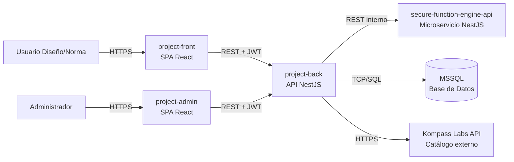

### 2.2 Funciones principales

1. **Autenticación y autorización** con JWT y control RBAC (roles ADMIN, NORM, DESIGN).
2. **Gestión de catálogos maestros**: países, normas, elementos, tipos, subtipos, campos, accesorios, semielaborados.
3. **Gestión de diseños eléctricos**: creación, edición, asociación de elementos y funciones, plantillas y hojas.
4. **Gestión de costos**: cálculo y desglose de costos por diseño y subdiseño.
5. **Cifrado y evaluación de fórmulas matemáticas** con parámetros y constantes.
6. **Administración de usuarios**: alta, edición, activación/desactivación, asignación de roles.
7. **Consulta de inventario externo** vía integración con Kompass Labs.

### 2.3 Características de los usuarios

| Rol | Perfil | Responsabilidades principales |
|-----|--------|-------------------------------|
| **ADMIN** | Administrador del sistema | Gestión de usuarios, asignación de roles, supervisión integral, acceso completo a la plataforma. |
| **NORM** | Especialista en normas | Creación, edición y publicación de normas eléctricas por país; gestión de elementos asociados. |
| **DESIGN** | Ingeniero de diseño | Creación y mantenimiento de diseños eléctricos, aplicación de normas, gestión de costos. |

### 2.4 Restricciones generales

- **RC-01.** El sistema debe operar sobre Microsoft SQL Server (versión 2019 o superior).
- **RC-02.** El frontend debe ser compatible con navegadores modernos (Chrome, Edge, Firefox, Safari, últimas dos versiones estables).
- **RC-03.** Las fórmulas de cálculo (DesignFunction) deben permanecer cifradas en reposo y solo desencriptarse en el microservicio dedicado.
- **RC-04.** Las contraseñas deben almacenarse con hashing bcrypt; nunca en texto plano.
- **RC-05.** La API central no debe exponer ningún endpoint sin autenticación JWT, salvo `POST /auth/login`.
- **RC-06.** El sistema debe operar en español como idioma principal de interfaz.

### 2.5 Supuestos y dependencias

- El cliente proporciona y mantiene las credenciales de acceso a la API externa de Kompass Labs.
- El sistema SAP del cliente proporciona referencias estables para los elementos catalogados.
- La infraestructura de despliegue (servidores, bases de datos, certificados) será provista por el cliente o el operador.

---

## 3. Requerimientos funcionales

### 3.1 Módulo de Autenticación y Autorización

| ID | Requerimiento | Prioridad |
|----|---------------|-----------|
| **RF-001** | El sistema debe permitir el inicio de sesión con correo electrónico y contraseña vía `POST /auth/login`. | Alta |
| **RF-002** | El sistema debe emitir un JWT con identificador de usuario, correo y roles, con expiración configurable. | Alta |
| **RF-003** | El sistema debe diferenciar el contexto de inicio de sesión entre las aplicaciones (`project-front` vs `project-admin`) mediante un parámetro `app`. | Alta |
| **RF-004** | El sistema debe rechazar el acceso a usuarios inactivos (campo `isActive = false`). | Alta |
| **RF-005** | El sistema debe aplicar guardas globales JWT y RBAC sobre todos los endpoints, excepto `POST /auth/login`. | Alta |
| **RF-006** | El sistema debe redirigir a una página `Forbidden` cuando un usuario intenta acceder a una sección sin el rol requerido. | Media |

### 3.2 Módulo de Usuarios

| ID | Requerimiento | Prioridad |
|----|---------------|-----------|
| **RF-010** | El sistema debe permitir crear usuarios con nombre, correo, contraseña y uno o más roles. | Alta |
| **RF-011** | El sistema debe listar usuarios con paginación y filtros de búsqueda. | Alta |
| **RF-012** | El sistema debe permitir editar los datos básicos de un usuario. | Alta |
| **RF-013** | El sistema debe permitir activar/desactivar un usuario sin eliminar su registro (PATCH `/users/:id/toggle-status`). | Alta |
| **RF-014** | El sistema debe registrar campos de auditoría (creado por, fecha de creación, modificado por, fecha de modificación). | Media |
| **RF-015** | Solo usuarios con rol **ADMIN** pueden acceder al módulo de Usuarios. | Alta |

### 3.3 Módulo de Países (Country)

| ID | Requerimiento | Prioridad |
|----|---------------|-----------|
| **RF-020** | El sistema debe permitir crear, editar, listar y eliminar países. | Alta |
| **RF-021** | Cada país debe tener un código ISO único y un nombre descriptivo. | Alta |
| **RF-022** | El país debe servir como contexto de alcance para normas y elementos. | Alta |

### 3.4 Módulo de Normas (Norm)

| ID | Requerimiento | Prioridad |
|----|---------------|-----------|
| **RF-030** | El sistema debe permitir crear, editar, listar (con paginación) y eliminar normas. | Alta |
| **RF-031** | Cada norma debe asociarse obligatoriamente a un país. | Alta |
| **RF-032** | El sistema debe permitir adjuntar archivos (PDF, documentos) a una norma. | Media |
| **RF-033** | El sistema debe permitir definir especificaciones detalladas (NormSpecification) por norma. | Alta |
| **RF-034** | El sistema debe permitir asociar elementos a una norma. | Alta |
| **RF-035** | El módulo de Normas debe ser accesible solo por roles **ADMIN** o **NORM**. | Alta |

### 3.5 Módulo de Catálogo (Type, SubType, Field, Element)

| ID | Requerimiento | Prioridad |
|----|---------------|-----------|
| **RF-040** | El sistema debe gestionar una jerarquía Field → Type → SubType para clasificar elementos. | Alta |
| **RF-041** | El sistema debe permitir crear elementos con referencia SAP, código, descripción, unidad de medida y relación con norma/tipo/subtipo. | Alta |
| **RF-042** | El sistema debe permitir buscar elementos por código, descripción o referencia SAP. | Media |
| **RF-043** | El sistema debe permitir gestionar accesorios y semielaborados como entidades catalogables independientes. | Media |
| **RF-044** | El sistema debe permitir gestionar elementos especiales (SpecialItem) personalizados por diseño. | Media |

### 3.6 Módulo de Diseños (Design)

| ID | Requerimiento | Prioridad |
|----|---------------|-----------|
| **RF-050** | El sistema debe permitir crear un diseño con nombre, código, tipo de diseño y subtipo. | Alta |
| **RF-051** | El sistema debe permitir asociar elementos disponibles al diseño (DesignElement). | Alta |
| **RF-052** | El sistema debe permitir definir funciones matemáticas (DesignFunction) asociadas al diseño y sus subtipos. | Alta |
| **RF-053** | Las funciones de diseño deben almacenarse **cifradas** en la base de datos. | Alta |
| **RF-054** | El sistema debe permitir gestionar plantillas (Template) y hojas (Sheet) asociadas a tipos de diseño. | Media |
| **RF-055** | El sistema debe permitir crear subdiseños (SubDesign) dentro de un diseño principal. | Media |
| **RF-056** | El sistema debe permitir consultar el detalle completo de un diseño (elementos, funciones, plantillas, costos). | Alta |
| **RF-057** | El módulo de Diseños debe ser accesible por roles **ADMIN** o **DESIGN**. | Alta |

### 3.7 Módulo de Costos (Cost)

| ID | Requerimiento | Prioridad |
|----|---------------|-----------|
| **RF-060** | El sistema debe permitir registrar costos por diseño. | Alta |
| **RF-061** | El sistema debe permitir desglosar un costo en subcostos (SubCost). | Alta |
| **RF-062** | El sistema debe permitir consultar y editar costos asociados a un diseño existente. | Alta |
| **RF-063** | Los costos deben respetar la moneda del país asociado al diseño. | Media |

### 3.8 Módulo de Cifrado y Evaluación de Funciones

| ID | Requerimiento | Prioridad |
|----|---------------|-----------|
| **RF-070** | El microservicio debe cifrar expresiones matemáticas en texto plano vía `POST /function-engine/encrypt`. | Alta |
| **RF-071** | El microservicio debe descifrar y evaluar expresiones cifradas vía `POST /function-engine/evaluate-function`, recibiendo parámetros y constantes. | Alta |
| **RF-072** | El microservicio debe usar `mathjs` como motor de evaluación segura de expresiones. | Alta |
| **RF-073** | El microservicio no debe almacenar fórmulas en texto plano ni en logs. | Alta |
| **RF-074** | La clave de cifrado debe estar configurada vía variable de entorno y nunca en código. | Alta |

### 3.9 Módulo de Integración con Kompass Labs

| ID | Requerimiento | Prioridad |
|----|---------------|-----------|
| **RF-080** | El sistema debe consultar el catálogo externo de Kompass Labs vía `POST /api/DocumentInbox/getItems`. | Alta |
| **RF-081** | El sistema debe permitir filtrar por palabra clave y tipo de inventario. | Alta |
| **RF-082** | La API key de Kompass Labs debe gestionarse vía variable de entorno. | Alta |

### 3.10 Aplicación Administrativa (`project-admin`)

| ID | Requerimiento | Prioridad |
|----|---------------|-----------|
| **RF-090** | La consola debe ofrecer un dashboard con métricas básicas del sistema. | Media |
| **RF-091** | La consola debe ofrecer pantallas de gestión de usuarios (alta, edición, activación, asignación de roles). | Alta |
| **RF-092** | La consola debe restringir su acceso únicamente a usuarios con rol **ADMIN**. | Alta |
| **RF-093** | La consola debe persistir la sesión vía `localStorage` con expiración del JWT. | Media |

### 3.11 Aplicación de Operación (`project-front`)

| ID | Requerimiento | Prioridad |
|----|---------------|-----------|
| **RF-100** | La aplicación debe ofrecer pantallas de inicio de sesión, listado y edición de normas. | Alta |
| **RF-101** | La aplicación debe ofrecer un workspace de creación y composición de diseños eléctricos. | Alta |
| **RF-102** | La aplicación debe ofrecer una pantalla de listado y detalle de diseños. | Alta |
| **RF-103** | La aplicación debe restringir el acceso a cada pantalla según el rol del usuario autenticado. | Alta |
| **RF-104** | La aplicación debe presentar los datos de manera reactiva mediante caché de RTK Query. | Media |

---

## 4. Requerimientos no funcionales

### 4.1 Seguridad

| ID | Requerimiento |
|----|---------------|
| **RNF-001** | Las contraseñas se almacenarán con hashing bcrypt (salt mínimo 10). |
| **RNF-002** | Todo endpoint de la API, excepto `POST /auth/login`, requiere JWT válido. |
| **RNF-003** | Las fórmulas de diseño se almacenarán cifradas; el descifrado solo ocurrirá en el microservicio Function Engine. |
| **RNF-004** | El control de acceso por rol (RBAC) se aplicará a nivel de backend (decoradores de roles) y frontend (rutas protegidas). |
| **RNF-005** | Las claves y secretos (JWT, cifrado, API keys externas) se gestionarán mediante variables de entorno. |
| **RNF-006** | El backend debe aceptar CORS únicamente desde los orígenes autorizados de los frontends. |

### 4.2 Desempeño

| ID | Requerimiento |
|----|---------------|
| **RNF-010** | El tiempo de respuesta promedio de los endpoints REST en condiciones nominales debe ser inferior a 500 ms (P95). |
| **RNF-011** | El listado paginado de entidades debe soportar al menos 10.000 registros sin degradación notable. |
| **RNF-012** | La evaluación de funciones cifradas debe completarse en menos de 200 ms para fórmulas con hasta 50 operandos. |

### 4.3 Disponibilidad y mantenibilidad

| ID | Requerimiento |
|----|---------------|
| **RNF-020** | El sistema debe contar con migraciones versionadas de base de datos (TypeORM migrations). |
| **RNF-021** | El backend debe incluir documentación OpenAPI (Swagger) navegable. |
| **RNF-022** | La cobertura de pruebas unitarias debe alcanzar el 80% en módulos de negocio del backend (umbral configurado en Jest). |
| **RNF-023** | El sistema debe permitir el despliegue independiente de cada componente (front, admin, back, function-engine). |

### 4.4 Usabilidad

| ID | Requerimiento |
|----|---------------|
| **RNF-030** | La interfaz debe ser responsive y operable en pantallas de 1280×720 o superiores. |
| **RNF-031** | La interfaz debe estar localizada en español. |
| **RNF-032** | Las pantallas deben mostrar estados de carga (skeletons) durante peticiones asíncronas. |
| **RNF-033** | La consola administrativa debe mostrar notificaciones (toasts) para confirmar acciones críticas. |

### 4.5 Compatibilidad y portabilidad

| ID | Requerimiento |
|----|---------------|
| **RNF-040** | Los frontends deben construirse con Vite y ser servibles como activos estáticos. |
| **RNF-041** | El backend y el microservicio deben ejecutarse en Node.js LTS (20+). |
| **RNF-042** | El sistema debe poder operar tras un reverse proxy (Nginx, Traefik, Cloudflare) sin reconfiguración del código. |

---

## 5. Casos de uso principales

### 5.1 Diagrama general de casos de uso

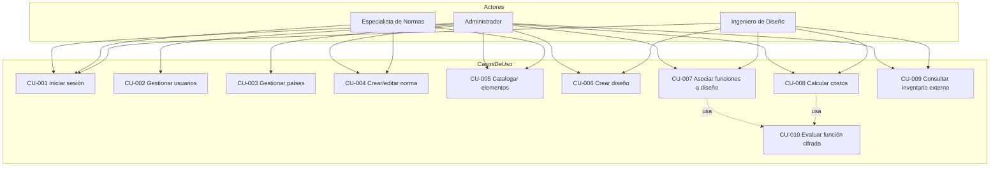

### 5.2 Casos de uso detallados

A continuación se describen los **diez casos de uso** del sistema con su plantilla completa (actores, precondiciones, postcondiciones, flujo principal, flujos alternativos, reglas relacionadas) y su diagrama de secuencia correspondiente.

---

#### CU-001 — Iniciar sesión

| Atributo | Valor |
|----------|-------|
| **Actor principal** | Usuario autenticable (ADMIN, NORM o DESIGN) |
| **Actores secundarios** | `project-back` (servicio Auth), MSSQL |
| **Aplicaciones** | `project-front`, `project-admin` |
| **Disparador** | El usuario accede a la URL de la aplicación |
| **Precondiciones** | El usuario existe en el sistema y `isActive = true`. |
| **Postcondición exitosa** | Sesión activa: JWT vigente almacenado y roles cargados. |
| **Postcondición de fallo** | Sesión no establecida; el usuario permanece en `/login`. |
| **Reglas relacionadas** | RN-AUTH-01, RN-AUTH-02, RN-03 |
| **Requerimientos** | RF-001, RF-002, RF-003, RF-004 |

**Flujo principal:**

1. El usuario abre la aplicación correspondiente.
2. Introduce correo y contraseña en el formulario de login.
3. El frontend envía `POST /auth/login` con `{ email, password, app }`.
4. El backend recupera el usuario por correo desde MSSQL.
5. El backend verifica la contraseña con `bcrypt.compare()`.
6. El backend valida que `isActive = true`.
7. El backend firma y emite un JWT con `sub`, `email`, `roles[]`, `exp`.
8. El frontend almacena el token y decodifica los roles.
9. El frontend redirige al panel correspondiente al rol.

**Flujos alternativos:**

- **4a.** Usuario no existe → 401 Unauthorized → mensaje "credenciales inválidas".
- **5a.** Contraseña incorrecta → 401 Unauthorized.
- **6a.** Usuario inactivo → 403 Forbidden → "usuario deshabilitado, contacte al administrador".
- **7a.** App no autorizada para el rol del usuario → 403 Forbidden → "no tiene acceso a esta aplicación".

**Diagrama de secuencia:**

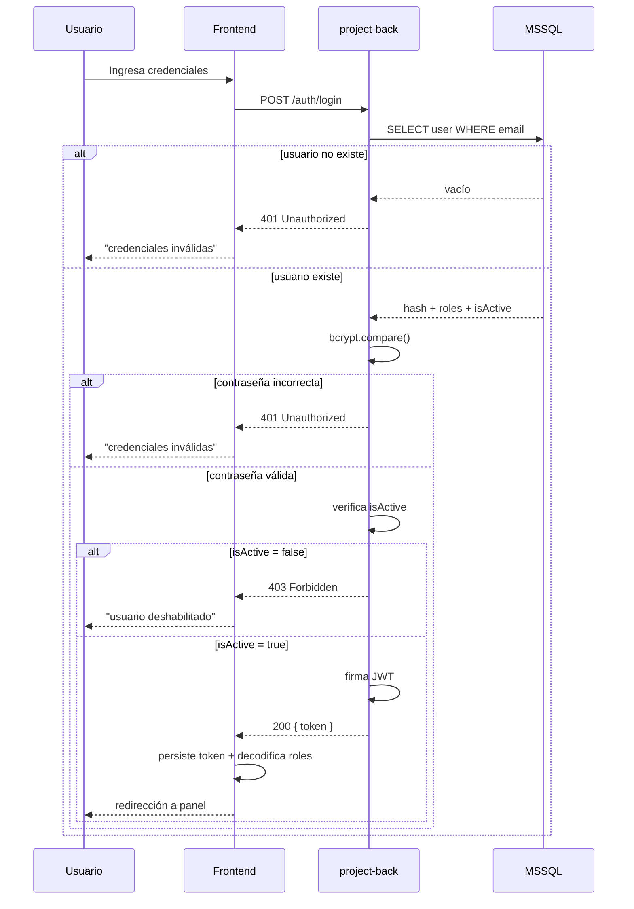

---

#### CU-002 — Gestionar usuarios

| Atributo | Valor |
|----------|-------|
| **Actor principal** | ADMIN |
| **Actores secundarios** | `project-back` (UsersModule), MSSQL |
| **Aplicación** | `project-admin` |
| **Disparador** | ADMIN navega a `/users` |
| **Precondiciones** | Sesión iniciada con rol ADMIN. |
| **Postcondición exitosa** | Catálogo de usuarios actualizado con campos de auditoría. |
| **Postcondición de fallo** | Operación rechazada; estado anterior íntegro. |
| **Reglas relacionadas** | RN-USR-01, RN-USR-02, RN-USR-03, RN-07 |
| **Requerimientos** | RF-010, RF-011, RF-012, RF-013, RF-014, RF-015 |

**Flujo principal:**

1. ADMIN navega a `/users` en `project-admin`.
2. La consola consulta `GET /users?page=1&limit=20`.
3. El backend retorna la lista paginada con metadatos.
4. ADMIN ejecuta una operación: alta, edición, toggle de estado o eliminación.
5. La consola envía la operación correspondiente al backend.
6. El backend valida unicidad de correo (en alta) y existencia (en edición/toggle/borrado).
7. El backend persiste y registra `createdBy/updatedBy/timestamps`.
8. La consola refresca la tabla y presenta toast de confirmación.

**Flujos alternativos:**

- **6a.** Correo duplicado (en alta) → 409 Conflict → toast de error.
- **6b.** Usuario inexistente (en edición) → 404 Not Found.
- **4a.** Toggle de estado a `inactive` → el usuario afectado pierde acceso en su próxima petición autenticada.

**Diagrama de secuencia:**

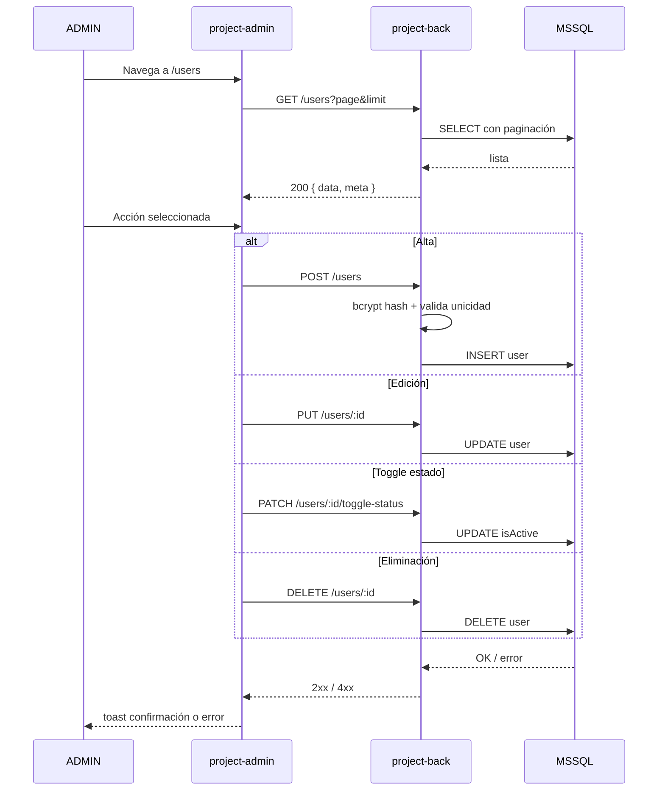

---

#### CU-003 — Gestionar países

| Atributo | Valor |
|----------|-------|
| **Actor principal** | ADMIN o NORM |
| **Actores secundarios** | `project-back` (CountryModule), MSSQL |
| **Aplicación** | `project-front` (módulo administrativo) |
| **Disparador** | El usuario accede al gestor de países |
| **Precondiciones** | Sesión activa con rol autorizado. |
| **Postcondición exitosa** | Catálogo de países actualizado. |
| **Postcondición de fallo** | Estado anterior íntegro; mensaje de error específico. |
| **Reglas relacionadas** | RN-CO-01, RN-09 |
| **Requerimientos** | RF-020, RF-021, RF-022 |

**Flujo principal:**

1. El usuario accede al módulo de países.
2. El sistema consulta `GET /country` y muestra el listado.
3. El usuario ejecuta una operación: alta, edición o eliminación.
4. El backend valida unicidad del código ISO en alta y edición.
5. En eliminación, el backend valida que no existan normas asociadas.
6. El backend persiste el cambio.
7. El sistema refresca el listado.

**Flujos alternativos:**

- **4a.** Código ISO duplicado → 409 Conflict.
- **5a.** País tiene normas asociadas → 409 Conflict → "no se puede eliminar país con normas".

**Diagrama de secuencia:**

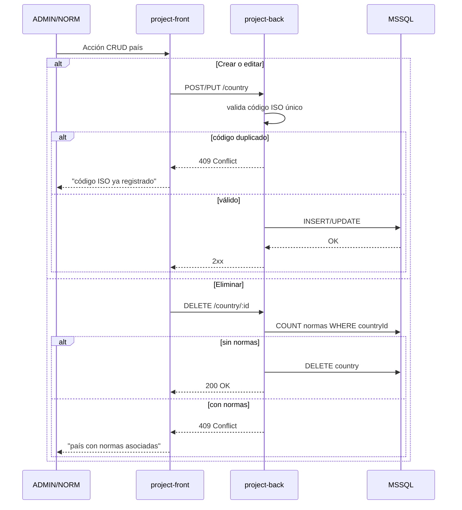

---

#### CU-004 — Crear/editar norma

| Atributo | Valor |
|----------|-------|
| **Actor principal** | ADMIN o NORM |
| **Actores secundarios** | `project-back` (NormModule), MSSQL, multer |
| **Aplicación** | `project-front` |
| **Disparador** | El usuario accede a `/norms/new` o `/norms/edit/:id` |
| **Precondiciones** | El país asociado existe. |
| **Postcondición exitosa** | Norma persistida con sus especificaciones, archivo opcional y elementos asociados. |
| **Postcondición de fallo** | Norma no creada/editada; estado anterior íntegro. |
| **Reglas relacionadas** | RN-NM-01, RN-NM-02, RN-01, RN-02, RN-10 |
| **Requerimientos** | RF-030, RF-031, RF-032, RF-033, RF-034 |

**Flujo principal:**

1. El usuario accede al listado de normas en `/`.
2. Selecciona país de filtro (opcional).
3. Acción "nueva norma" lleva a `/norms/new` (o "editar" a `/norms/edit/:id`).
4. Captura código, nombre y especificaciones.
5. Adjunta archivo PDF si aplica.
6. Asocia elementos del catálogo.
7. El frontend envía `POST /norm` (o `PUT /norm/:id`).
8. Si hay archivo, el frontend envía `POST /norm/:id/file`.
9. El backend valida que el país exista y que los elementos sean del mismo país.
10. El backend persiste norma, especificaciones, archivo y relaciones.

**Flujos alternativos:**

- **9a.** Elemento de país distinto → 400 Bad Request.
- **5a.** Archivo supera tamaño máximo → 413 Payload Too Large.
- **9b.** País inexistente → 400 Bad Request.

**Diagrama de secuencia:**

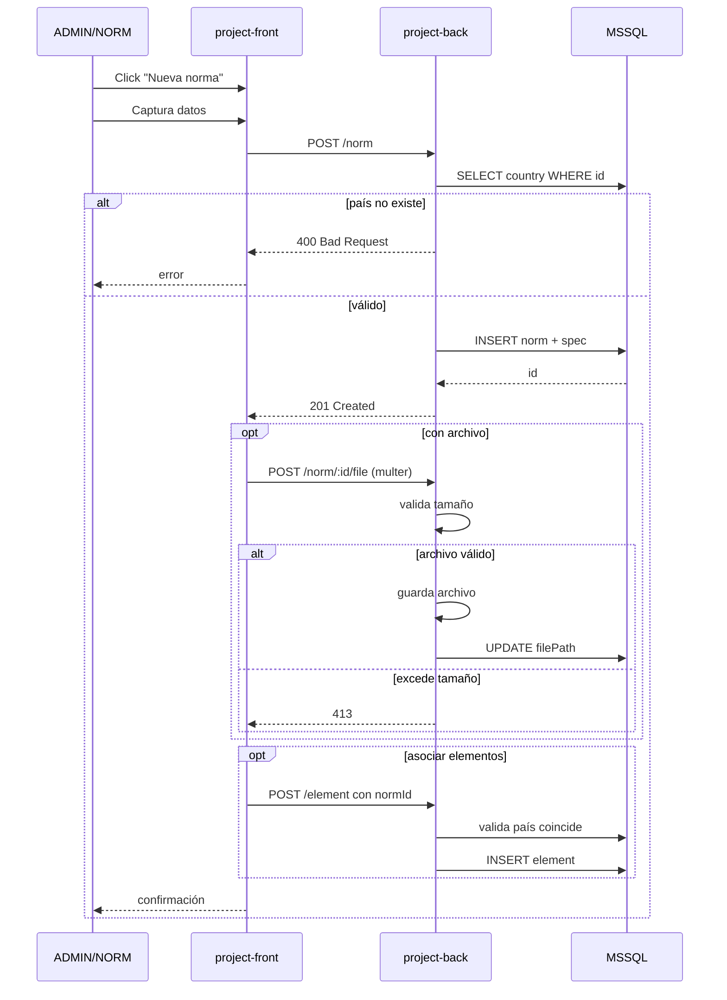

---

#### CU-005 — Catalogar elementos

| Atributo | Valor |
|----------|-------|
| **Actor principal** | ADMIN o NORM |
| **Actores secundarios** | `project-back` (ElementModule), MSSQL |
| **Aplicación** | `project-front` |
| **Disparador** | El usuario abre el gestor de elementos dentro de una norma |
| **Precondiciones** | Existen Norma, Field, Type y SubType en el catálogo. |
| **Postcondición exitosa** | Elemento persistido y disponible para diseños. |
| **Postcondición de fallo** | Elemento no creado; mensaje de validación específico. |
| **Reglas relacionadas** | RN-EL-01, RN-EL-02, RN-FT-01, RN-08, RN-01 |
| **Requerimientos** | RF-040, RF-041, RF-042 |

**Flujo principal:**

1. El usuario navega al gestor de elementos.
2. Captura referencia SAP, código interno, descripción y unidad de medida.
3. Selecciona Norma, Type, SubType desde listas dependientes.
4. El frontend envía `POST /element`.
5. El backend valida unicidad de referencia SAP en el catálogo activo.
6. El backend valida coherencia jerárquica (SubType pertenece a Type; Type pertenece a Field).
7. El backend valida que la Norma sea del mismo país que el contexto.
8. El backend persiste el elemento.

**Flujos alternativos:**

- **5a.** Referencia SAP duplicada → 409 Conflict.
- **6a.** Inconsistencia jerárquica → 400 Bad Request.
- **7a.** Norma de otro país → 400 Bad Request (RN-01).

**Diagrama de secuencia:**

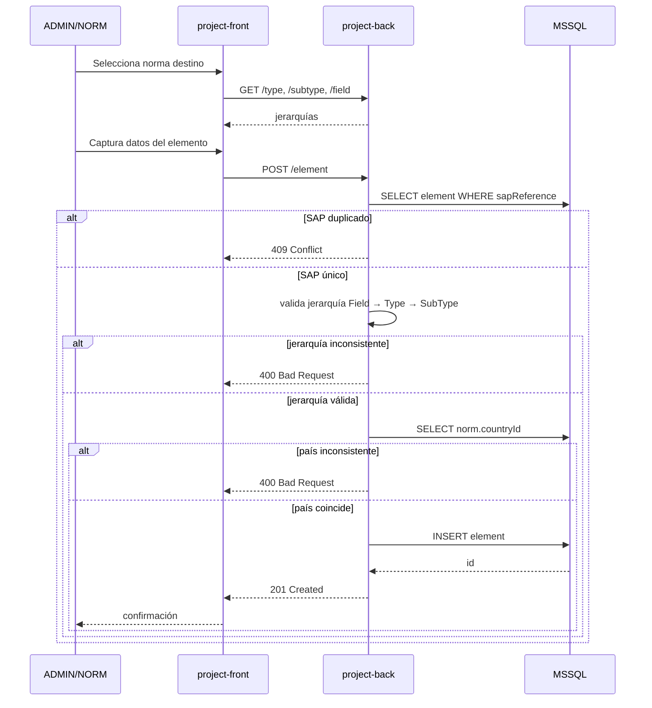

---

#### CU-006 — Crear diseño

| Atributo | Valor |
|----------|-------|
| **Actor principal** | ADMIN o DESIGN |
| **Actores secundarios** | `project-back` (DesignModule), MSSQL |
| **Aplicación** | `project-front` |
| **Disparador** | El usuario accede a `/design` |
| **Precondiciones** | Existen DesignType y DesignSubType configurados; existen elementos disponibles. |
| **Postcondición exitosa** | Diseño creado con cabecera, tipo/subtipo y elementos asociados. |
| **Postcondición de fallo** | Diseño no creado; estado anterior íntegro. |
| **Reglas relacionadas** | RN-DS-01, RN-05 |
| **Requerimientos** | RF-050, RF-051, RF-056 |

**Flujo principal:**

1. El usuario navega a `/design`.
2. Captura nombre y código del diseño.
3. Selecciona DesignType y DesignSubType.
4. Compone el diseño en `/elements/design` seleccionando elementos disponibles.
5. El frontend envía `POST /design` con cabecera y `DesignElement[]`.
6. El backend valida que el subtipo pertenezca al tipo seleccionado.
7. El backend persiste cabecera, tipo, subtipo y `design_element[]`.
8. El frontend redirige al workspace para asociar funciones (CU-007).

**Flujos alternativos:**

- **6a.** Subtipo no pertenece al tipo → 400 Bad Request.
- **4a.** Diseño guardado como borrador sin elementos → permitido (queda en estado *Borrador*).

**Diagrama de secuencia:**

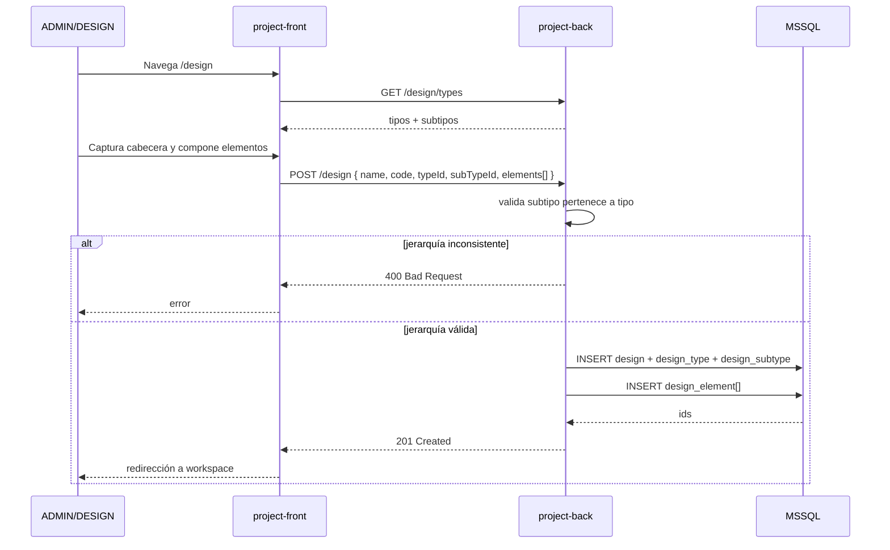

---

#### CU-007 — Asociar funciones a diseño

| Atributo | Valor |
|----------|-------|
| **Actor principal** | ADMIN o DESIGN |
| **Actores secundarios** | `project-back` (DesignModule), `secure-function-engine-api`, MSSQL |
| **Aplicación** | `project-front` |
| **Disparador** | El usuario abre el editor de funciones dentro de un diseño |
| **Precondiciones** | Diseño existe con tipo y subtipo asignados. |
| **Postcondición exitosa** | `DesignFunction` persistida en estado **cifrado** y asociada al subtipo. |
| **Postcondición de fallo** | Función no asociada; texto plano nunca persistido. |
| **Reglas relacionadas** | RN-DS-02, RN-FN-01, RN-FN-02, RN-04 |
| **Requerimientos** | RF-052, RF-053, RF-070, RF-074 |

**Flujo principal:**

1. El usuario abre el editor de funciones del diseño.
2. Captura la expresión matemática en texto plano y constantes asociadas.
3. El frontend envía `POST /design/:id/functions { plainTextFunction, constants }`.
4. El backend invoca `POST /function-engine/encrypt`.
5. Function Engine cifra la expresión con AES y retorna `{ encrypted }`.
6. El backend persiste `DesignFunction` con la versión cifrada y `DesignSubTypeFunction`.
7. El backend responde sin incluir el texto plano original.

**Flujos alternativos:**

- **4a.** Function Engine inalcanzable → 503 Service Unavailable → reintento configurable.
- **2a.** Expresión inválida sintácticamente (validación previa con `mathjs.parse`) → 400 Bad Request.

**Diagrama de secuencia:**

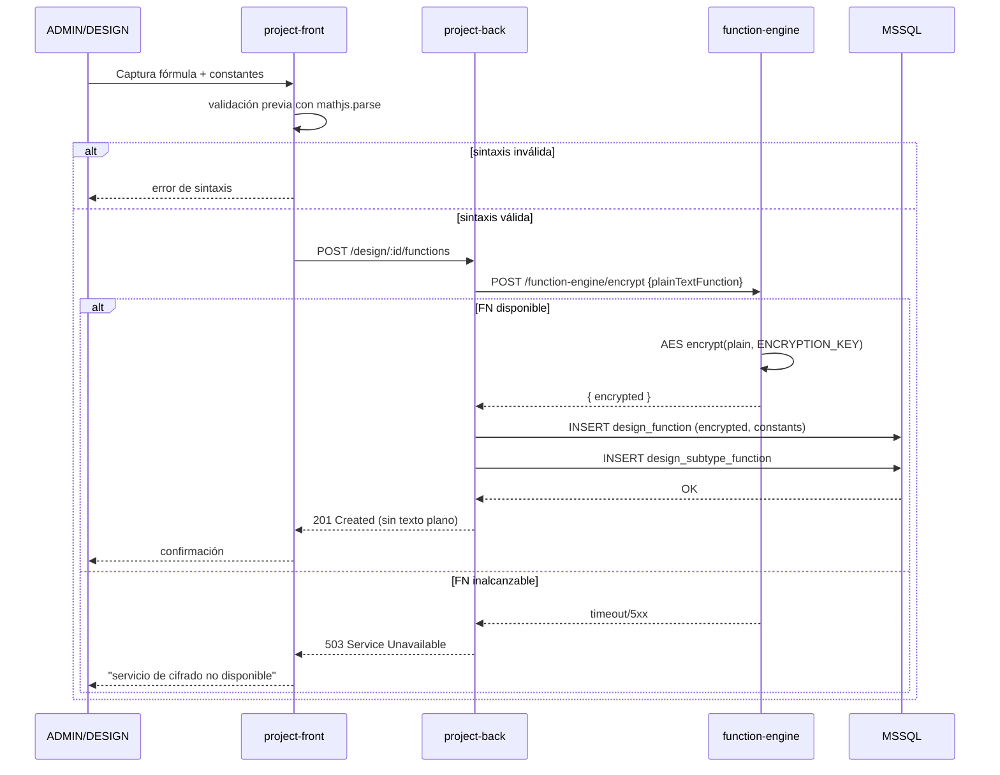

---

#### CU-008 — Calcular costos

| Atributo | Valor |
|----------|-------|
| **Actor principal** | ADMIN o DESIGN |
| **Actores secundarios** | `project-back` (CostsModule), `secure-function-engine-api` (vía CU-010), MSSQL |
| **Aplicación** | `project-front` |
| **Disparador** | El usuario abre la sección de costos de un diseño |
| **Precondiciones** | Diseño existe con elementos y, opcionalmente, funciones de costo. |
| **Postcondición exitosa** | Costos persistidos en `Cost` y `SubCost` consistentes (suma cuadra con total). |
| **Postcondición de fallo** | Costos no persistidos; estado anterior íntegro. |
| **Reglas relacionadas** | RN-CO-01, RN-CO-02, RN-CO-03, RN-06, RN-DS-03 |
| **Requerimientos** | RF-060, RF-061, RF-062, RF-063 |

**Flujo principal:**

1. El usuario abre la sección de costos del diseño.
2. El sistema lista los elementos del diseño con cantidades.
3. El sistema obtiene precios referenciales (interno o vía Kompass Labs).
4. Si el costo se calcula vía función, el backend invoca **CU-010 — Evaluar función cifrada**.
5. El usuario captura/ajusta líneas de SubCost.
6. El frontend envía `POST /cost { total, subCosts[] }`.
7. El backend valida que `Σ subCost.amount == total`.
8. El backend persiste `Cost` y `SubCost[]`.

**Flujos alternativos:**

- **7a.** Inconsistencia de suma → 400 Bad Request.
- **4a.** Function Engine inalcanzable → degrada a cálculo manual con notificación al usuario.
- **Posterior.** Si los elementos del diseño cambian luego del cálculo, los costos quedan **invalidados** y deben recalcularse (RN-06).

**Diagrama de secuencia:**

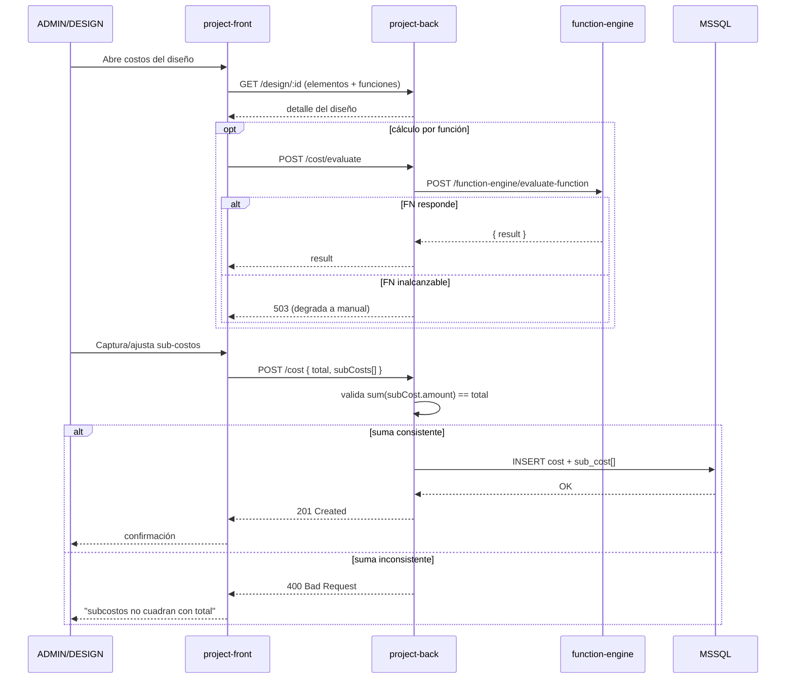

---

#### CU-009 — Consultar inventario externo

| Atributo | Valor |
|----------|-------|
| **Actor principal** | ADMIN o DESIGN |
| **Actores secundarios** | `project-back` (AccesoryModule), Kompass Labs API |
| **Sistema externo** | `https://rymelapi.kompasslabs.com` |
| **Aplicación** | `project-front` |
| **Disparador** | El usuario abre el buscador de accesorios |
| **Precondiciones** | Sistema configurado con `KOMPASS_API_KEY` válida. |
| **Postcondición exitosa** | Resultados de inventario presentados al usuario, con opción de incorporación al diseño. |
| **Postcondición de fallo** | Lista vacía o mensaje de servicio no disponible. |
| **Reglas relacionadas** | RN-ACC-01, RN-ACC-02 |
| **Requerimientos** | RF-080, RF-081, RF-082 |

**Flujo principal:**

1. El usuario abre el buscador de accesorios.
2. Introduce palabra clave y tipo de inventario.
3. El frontend envía `GET /accesory?keyword=...&type=...`.
4. El backend (módulo `accesory`) construye solicitud autenticada con la API Key.
5. El backend invoca `POST /api/DocumentInbox/getItems` en Kompass Labs.
6. El backend transforma la respuesta a formato interno y la retorna.
7. El frontend muestra los resultados con opción de incorporar al diseño.

**Flujos alternativos:**

- **5a.** Kompass Labs no disponible → 503 → mensaje "servicio externo no disponible, reintente".
- **5b.** API Key inválida o vencida → 401 desde Kompass → log de alerta operativa; el usuario final ve "error temporal".
- **6a.** Sin resultados → lista vacía con sugerencia de búsqueda alternativa.

**Diagrama de secuencia:**

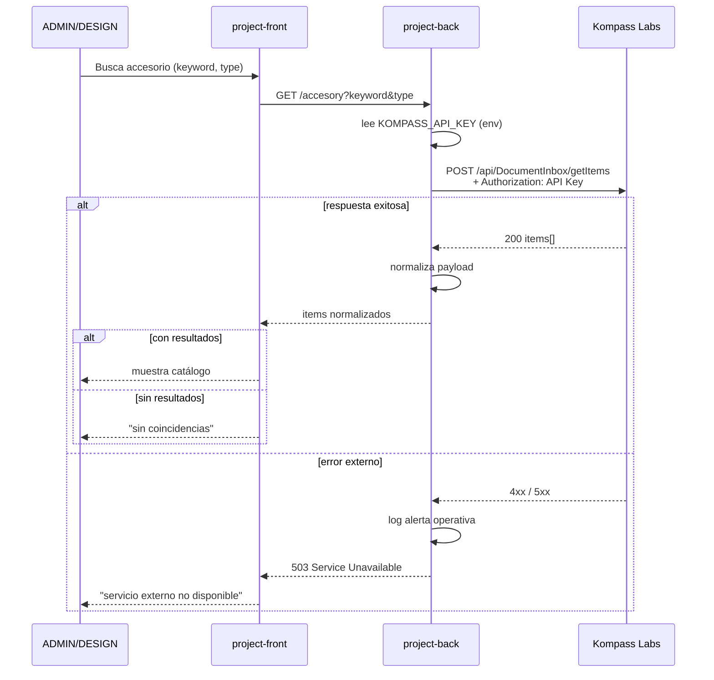

---

#### CU-010 — Evaluar función cifrada

| Atributo | Valor |
|----------|-------|
| **Actor principal** | Sistema (orquestación interna por `project-back`) |
| **Actores secundarios** | `secure-function-engine-api`, MSSQL |
| **Disparador** | Otro caso de uso (CU-008 u otro de cálculo) requiere evaluar la fórmula de un diseño |
| **Precondiciones** | Existe `DesignFunction` cifrada asociada al diseño. |
| **Postcondición exitosa** | Resultado numérico calculado retornado al caso de uso solicitante. |
| **Postcondición de fallo** | Error específico retornado; ningún dato sensible expuesto. |
| **Reglas relacionadas** | RN-FN-01, RN-FN-02, RN-FN-03, RN-04, RN-DS-02 |
| **Requerimientos** | RF-070, RF-071, RF-072, RF-073, RF-074 |

**Flujo principal:**

1. Otro caso de uso requiere evaluar la fórmula con parámetros específicos.
2. `project-back` recupera `encryptedFunction` y `constants` desde `DesignFunction`.
3. `project-back` invoca `POST /function-engine/evaluate-function` con `{ encryptedFunction, parameters, constants }`.
4. Function Engine descifra la expresión en memoria con `ENCRYPTION_KEY`.
5. Function Engine evalúa con `mathjs` en alcance restringido (parameters + constants).
6. Function Engine retorna `{ result }`.
7. `project-back` retorna el resultado al caso de uso solicitante.

**Flujos alternativos:**

- **4a.** Falla de descifrado (clave incorrecta) → 500 Internal Server Error → alerta operativa.
- **5a.** Variable referenciada en la fórmula no presente en `parameters/constants` → 400 Bad Request → mensaje específico.
- **5b.** Operación matemática inválida (división por cero, dominio inválido) → 400 Bad Request.

**Diagrama de secuencia:**

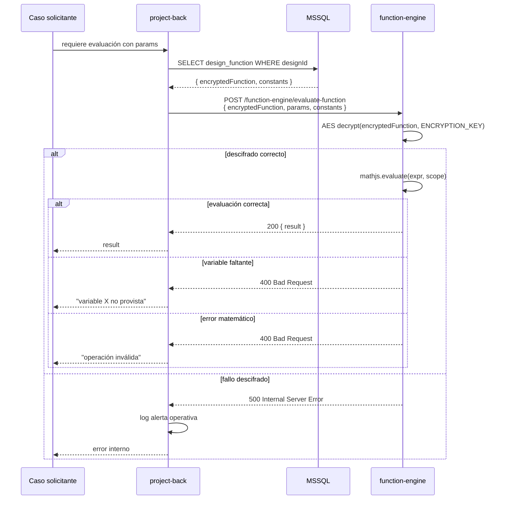

---

---

## 6. Reglas de negocio

| ID | Regla |
|----|-------|
| **RN-01** | Un elemento solo puede asociarse a una norma del mismo país. |
| **RN-02** | Una norma pertenece a un único país. |
| **RN-03** | Un usuario inactivo no puede iniciar sesión, aunque sus credenciales sean correctas. |
| **RN-04** | Las funciones de diseño deben permanecer cifradas en reposo y en tránsito hacia almacenamiento. |
| **RN-05** | Un diseño debe tener al menos un tipo y un subtipo asignados antes de permitir asociar funciones. |
| **RN-06** | Los costos deben recalcularse cuando cambia la composición de elementos o las funciones del diseño. |
| **RN-07** | Solo usuarios con rol ADMIN pueden modificar el catálogo de usuarios. |
| **RN-08** | La jerarquía de catálogo Field → Type → SubType es obligatoria; un Type sin Field no puede registrarse. |
| **RN-09** | La eliminación de un país debe rechazarse si tiene normas asociadas. |
| **RN-10** | Los archivos adjuntos a una norma se almacenan referenciados; la norma es la entidad propietaria. |

---

## 7. Trazabilidad inicial requerimiento → módulo

| Requerimiento | Módulo de implementación |
|---------------|--------------------------|
| RF-001 .. RF-006 | `project-back/src/modules/auth` + `project-front/src/context/AuthContext` + `project-admin/src/store/authStore` |
| RF-010 .. RF-015 | `project-back/src/modules/users` + `project-admin/src/pages/UsersPage` |
| RF-020 .. RF-022 | `project-back/src/modules/country` |
| RF-030 .. RF-035 | `project-back/src/modules/norm` + `project-front/src/pages/Norm*` |
| RF-040 .. RF-044 | `project-back/src/modules/{element,type,subtype,field,accesory,semi-finished}` |
| RF-050 .. RF-057 | `project-back/src/modules/design` + `project-front/src/pages/Design*` |
| RF-060 .. RF-063 | `project-back/src/modules/costs` |
| RF-070 .. RF-074 | `secure-function-engine-api` |
| RF-080 .. RF-082 | `project-back/src/modules/accesory` (cliente HTTP a Kompass Labs) |
| RF-090 .. RF-093 | `project-admin` (todas las pantallas) |
| RF-100 .. RF-104 | `project-front` (todas las pantallas) |

---

## 8. Aprobación y control de cambios

Cualquier modificación a este documento debe registrarse en la tabla siguiente y notificarse formalmente al cliente.

| Versión | Fecha | Autor | Descripción del cambio |
|---------|-------|-------|------------------------|
| 1.0.0 | 2026-05-06 | Alex Pinaida | Línea base inicial: requerimientos funcionales, no funcionales, casos de uso detallados con diagramas y reglas de negocio. |
