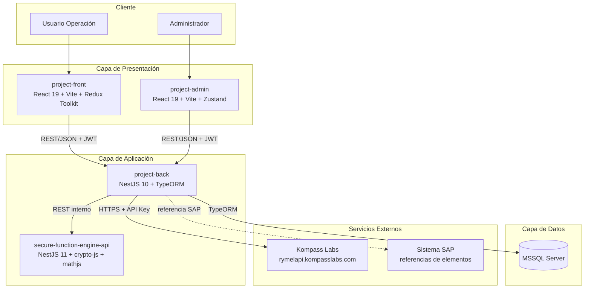
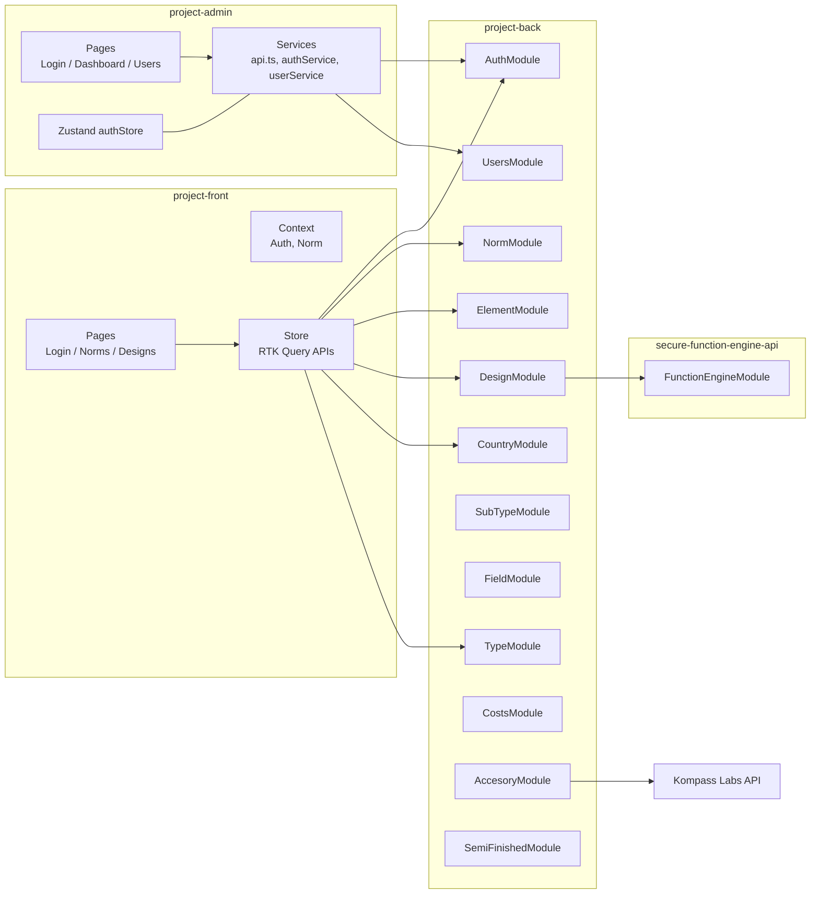
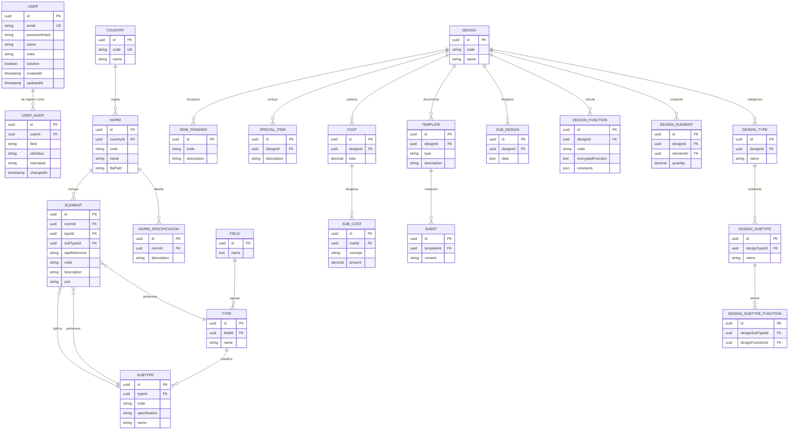
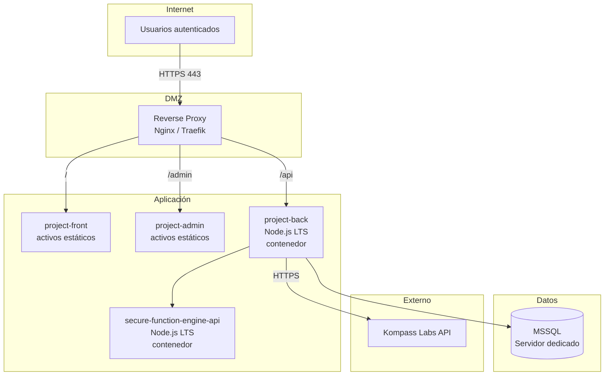
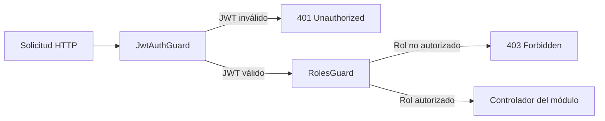
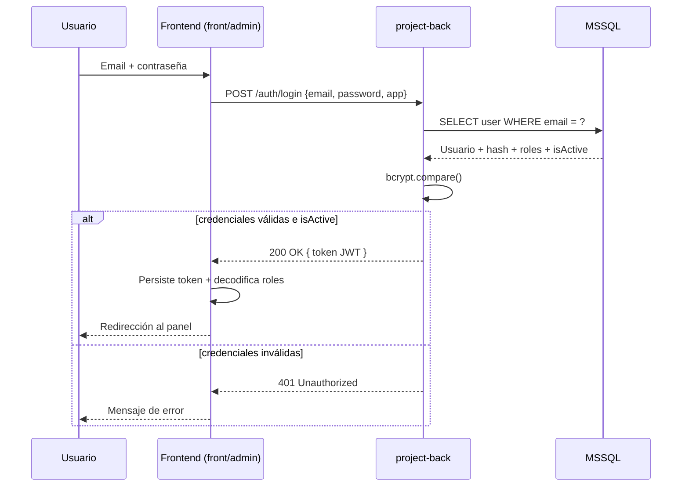
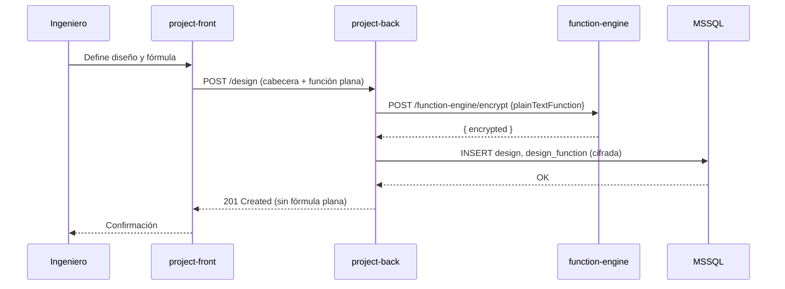
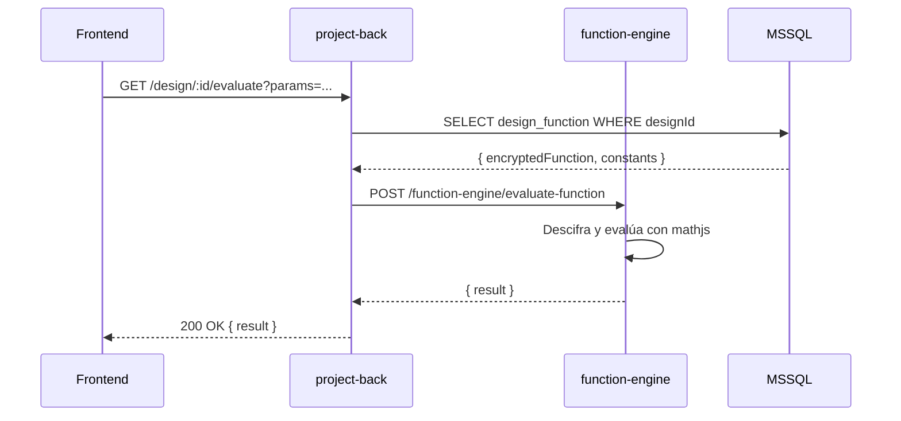

# DOC-02 — Documento de Arquitectura Técnica

**Proyecto:** Plataforma Rymel
**Cliente:** Rymel
**Versión:** 1.0.0
**Autor:** Alex Pinaida
**Fecha:** 2026-05-06

---

## 1. Introducción

### 1.1 Propósito

Este documento describe la arquitectura técnica de la **Plataforma Rymel**: sus componentes, sus tecnologías, su modelo de datos, sus integraciones, sus mecanismos de seguridad y su estrategia de despliegue. Sirve como referencia para los equipos de desarrollo, operaciones e integración.

### 1.2 Alcance

Cubre los cuatro componentes técnicos del sistema:

| Componente | Tipo | Puerto por defecto | Repositorio |
|------------|------|---------------------|-------------|
| `project-back` | API REST (NestJS) | `3000` | `Rymel/project-back` |
| `project-front` | SPA Web (React + Vite) | `5173` (dev) | `Rymel/project-front` |
| `project-admin` | SPA Web (React + Vite) | `5174` (dev) | `Rymel/project-admin` |
| `secure-function-engine-api` | Microservicio (NestJS) | `5000` | `Rymel/secure-function-engine-api` |

---

## 2. Estilo arquitectónico

La plataforma adopta una arquitectura **cliente-servidor con segregación funcional y un microservicio especializado**:

- **Frontend** desacoplado en dos SPAs con responsabilidades distintas (operación vs administración).
- **Backend monolítico modular** organizado por dominio (NestJS), que actúa como Backend-for-Frontend único.
- **Microservicio dedicado** a operaciones criptográficas y evaluación de fórmulas, aislando un dominio sensible.
- **Base de datos relacional** central (MSSQL).
- **Integración con catálogo externo** de Kompass Labs vía REST.



---

## 3. Stack tecnológico consolidado

### 3.1 `project-back` (núcleo del sistema)

| Categoría | Tecnología | Versión |
|-----------|------------|---------|
| Framework | NestJS | 10.x |
| Lenguaje | TypeScript | 5.x |
| ORM | TypeORM | 0.3.x |
| Base de datos | Microsoft SQL Server | 2019+ |
| Autenticación | `@nestjs/jwt`, `@nestjs/passport`, `passport-jwt` | — |
| Hashing | bcrypt | 6.x |
| Validación | class-validator, class-transformer | — |
| Documentación API | `@nestjs/swagger` + Swagger UI | 7.x |
| Cliente HTTP | `@nestjs/axios` (Axios) | — |
| Subida de archivos | multer | 1.4.x |
| Pruebas | Jest, supertest | 29.x |

### 3.2 `project-front` (aplicación de operación)

| Categoría | Tecnología | Versión |
|-----------|------------|---------|
| Framework | React | 19.x |
| Build | Vite | 5.x |
| Lenguaje | TypeScript | 5.x |
| Estado global | Redux Toolkit + RTK Query | 2.x |
| Routing | React Router DOM | 6.x |
| Estilos | Tailwind CSS | 3.x |
| Visualización | Chart.js + react-chartjs-2 | 4.x / 5.x |
| Cálculo cliente | mathjs | 14.x |
| Decodificación JWT | jwt-decode | 4.x |
| Lectura de documentos | mammoth | 1.x |
| Iconografía | lucide-react, react-icons | — |

### 3.3 `project-admin` (consola administrativa)

| Categoría | Tecnología | Versión |
|-----------|------------|---------|
| Framework | React | 19.x |
| Build | Vite | 7.x |
| Lenguaje | TypeScript | 5.9 |
| Estado global | Zustand | 5.x |
| Estado servidor | TanStack React Query | 5.x |
| Routing | wouter | 3.x |
| HTTP | Axios + interceptores | 1.x |
| Estilos | Tailwind CSS v4 | 4.x |
| Notificaciones | sonner | 2.x |
| Iconografía | @tabler/icons-react | 3.x |

### 3.4 `secure-function-engine-api` (motor seguro de funciones)

| Categoría | Tecnología | Versión |
|-----------|------------|---------|
| Framework | NestJS | 11.x |
| Lenguaje | TypeScript | 5.7 |
| Cifrado | crypto-js, node-forge | 4.x / 1.3 |
| Evaluación matemática | mathjs | 14.x |
| HTTP | node-fetch | 2.x |
| Configuración | dotenv | 16.x |

---

## 4. Vista de componentes



---

## 5. Modelo de datos

### 5.1 Diagrama Entidad-Relación



> **Nota:** El esquema se ha derivado del análisis de las 20 migraciones de TypeORM presentes en `project-back/src/db/migrations/`. Algunos campos auxiliares se omiten para legibilidad.

### 5.2 Migraciones versionadas

El proyecto cuenta con un historial completo y trazable de migraciones:

```
1725400986639-initial.ts                   → Esquema base
1731034188496-subtype.ts                    → Adición de SubType
1734228374747-semifinished.ts               → Catálogo de semielaborados
1734303557223-country-code.ts               → Código ISO de país
1735256664271-subtype-code-specification.ts → Campos code y specification en SubType
1735330413350-special-item.ts               → Items especiales
1735330608577-sap-reference.ts              → Referencia SAP en Element
1742269102879-norm-file.ts                  → Adjunto de archivo en Norm
1745805671356-design.ts                     → Módulo de diseño
1748477764697-design-function-code.ts       → Código de función de diseño
1748898299167-design-function-constants.ts  → Constantes en funciones
1752537428010-templates.ts                  → Plantillas de diseño
1752621506601-template-description.ts       → Descripción en plantilla
1753134579961-sub-design-data.ts            → Datos de subdiseño
1753474504294-design-with-subtype.ts        → Relación diseño-subtipo
1759807970227-subtype-design-type-relations → Relaciones cruzadas
1764034622905-auth-user.ts                  → Refuerzo de autenticación
1764901127685-user-audit-fields.ts          → Auditoría de usuarios
1768097892882-costs.ts                      → Módulo de costos
1771559492573-template-sheets.ts            → Hojas de plantilla
```

---

## 6. Vista de despliegue

### 6.1 Topología de referencia (entorno productivo)



### 6.2 Variables de entorno relevantes

| Componente | Variable | Propósito |
|------------|----------|-----------|
| `project-back` | `DB_HOST`, `DB_PORT`, `DB_USER`, `DB_PASSWORD`, `DB_NAME` | Conexión a MSSQL |
| `project-back` | `JWT_SECRET`, `JWT_EXPIRES_IN` | Firma y vigencia de tokens |
| `project-back` | `FUNCTION_ENGINE_URL` | URL del microservicio de funciones |
| `project-back` | `KOMPASS_API_URL`, `KOMPASS_API_KEY` | Integración externa |
| `project-back` | `CORS_ORIGINS` | Orígenes web autorizados |
| `secure-function-engine-api` | `ENCRYPTION_KEY` | Clave simétrica de cifrado |
| `project-front` | `VITE_REACT_APP_API_URL` | URL del backend |
| `project-admin` | `VITE_API_URL` | URL del backend |

> **Recomendación de seguridad:** rotar las claves y secretos al menos cada 90 días y mantenerlos en un gestor de secretos (Azure Key Vault, AWS Secrets Manager o HashiCorp Vault).

---

## 7. Seguridad

### 7.1 Autenticación

- Esquema **stateless** basado en JWT firmado con HS256.
- Login expone únicamente `POST /auth/login`; resto de endpoints exigen `Authorization: Bearer <token>`.
- El frontend almacena el token en `localStorage`; el cliente HTTP (Axios o RTK Query) inyecta la cabecera automáticamente.
- El interceptor de respuestas trata el código `401` redirigiendo al login.

### 7.2 Autorización (RBAC)



| Rol | Acceso |
|-----|--------|
| **ADMIN** | Total. |
| **NORM** | Módulos de Country, Norm, Element, Type, SubType, Field. |
| **DESIGN** | Módulos de Design, Cost, Element (lectura), SubType (lectura). |

### 7.3 Cifrado de funciones de diseño

- Las fórmulas se cifran con cifrado simétrico (AES vía `crypto-js`).
- La clave se gestiona como variable de entorno en `secure-function-engine-api`.
- Las fórmulas viajan cifradas entre `project-back` y `secure-function-engine-api`.
- El microservicio descifra solo en memoria, evalúa con `mathjs` y retorna el resultado numérico.
- En logs y trazas no se expone la fórmula descifrada.

### 7.4 Otros controles

- **CORS** restringido a los orígenes legítimos (`localhost:5173`, `localhost:5174` en desarrollo; dominios productivos en operación).
- **Validación de entrada** mediante DTOs con `class-validator` en todos los controladores.
- **Hashing** de contraseñas con bcrypt.
- **Auditoría** de usuarios (createdBy, updatedBy, timestamps).

---

## 8. Integraciones externas

### 8.1 Kompass Labs (catálogo de inventario)

| Atributo | Valor |
|----------|-------|
| Base URL | `https://rymelapi.kompasslabs.com` |
| Endpoint principal | `POST /api/DocumentInbox/getItems` |
| Autenticación | API Key en cabecera |
| Caso de uso | Consulta de accesorios y componentes para enriquecer el catálogo interno. |
| Patrón | Fachada en `AccesoryModule` del backend; el frontend nunca llama directamente. |

### 8.2 SAP (referencia)

- Los elementos contienen el atributo `sapReference` que actúa como puente lógico hacia el ERP del cliente.
- No se realiza integración en línea con SAP en la fase actual; está prevista como evolución (ver DOC-04 §6).

### 8.3 Function Engine (interno)

| Atributo | Valor |
|----------|-------|
| Base URL | `http://function-engine:5000` (resolución por DNS interno) |
| Endpoints | `POST /function-engine/encrypt`, `POST /function-engine/evaluate-function` |
| Patrón | Sidecar/microservicio detrás de la red privada; no expuesto a Internet. |

---

## 9. Vista de procesos (interacciones clave)

### 9.1 Inicio de sesión



### 9.2 Creación de diseño con función cifrada



### 9.3 Evaluación de función cifrada



---

## 10. Calidad y observabilidad

| Aspecto | Práctica adoptada |
|---------|-------------------|
| Pruebas unitarias | Jest + ts-jest, umbral 80% en backend (configurado en `jest.coverageThreshold`). |
| Pruebas E2E | supertest (estructura preparada en `test/`). |
| Linting | ESLint con configuración compartida en cada proyecto. |
| Formato | Prettier en backends y ESLint en frontends. |
| Migraciones | Versionadas y reproducibles vía TypeORM CLI (`npm run migration:run`). |
| Documentación viva | Swagger UI expuesto en `/api/docs` del backend. |
| Logs | Logger nativo de NestJS; recomendado integración futura con ELK/Datadog. |

---

## 11. Decisiones arquitectónicas registradas (ADR resumido)

| ADR | Decisión | Razón |
|-----|----------|-------|
| **ADR-01** | Frontend dividido en dos SPAs (operación vs admin) | Aislar superficie de ataque del módulo administrativo y permitir despliegues independientes. |
| **ADR-02** | Microservicio dedicado para cifrado y evaluación de funciones | Limitar el alcance de la clave criptográfica y permitir endurecimiento independiente. |
| **ADR-03** | Persistencia centralizada en MSSQL | Compatibilidad con la infraestructura del cliente y disponibilidad de TypeORM como ORM probado. |
| **ADR-04** | RTK Query en `project-front`, React Query + Zustand en `project-admin` | El equipo administrativo es más reciente; se eligió un stack más liviano para reducir overhead. Se mantiene RTK Query en `project-front` por la complejidad de su caché de catálogos. |
| **ADR-05** | Migraciones versionadas obligatorias | Trazabilidad completa del esquema y reproducibilidad de despliegues. |

---

## 12. Roadmap técnico (alto nivel)

Se desarrolla con detalle en DOC-04 §6. Resumen:

1. **Fase de endurecimiento:** secret manager, rotación de claves, hardening de CORS, observabilidad centralizada.
2. **Fase de integraciones:** conector SAP en línea, sincronización bidireccional con Kompass Labs.
3. **Fase de escalabilidad:** caché distribuido (Redis), separación de motores de lectura/escritura, contenerización completa.
4. **Fase de evolución funcional:** versionado de normas y diseños, flujos de aprobación, reportería avanzada.

---

## 13. Control de versiones del documento

| Versión | Fecha | Autor | Descripción del cambio |
|---------|-------|-------|------------------------|
| 1.0.0 | 2026-05-06 | Alex Pinaida | Línea base inicial: estilo arquitectónico, stack consolidado, modelo de datos, vista de despliegue, seguridad, integraciones, ADRs y roadmap técnico. |
