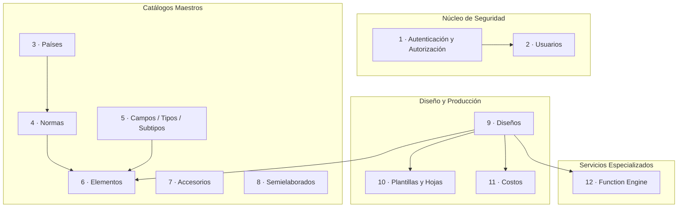
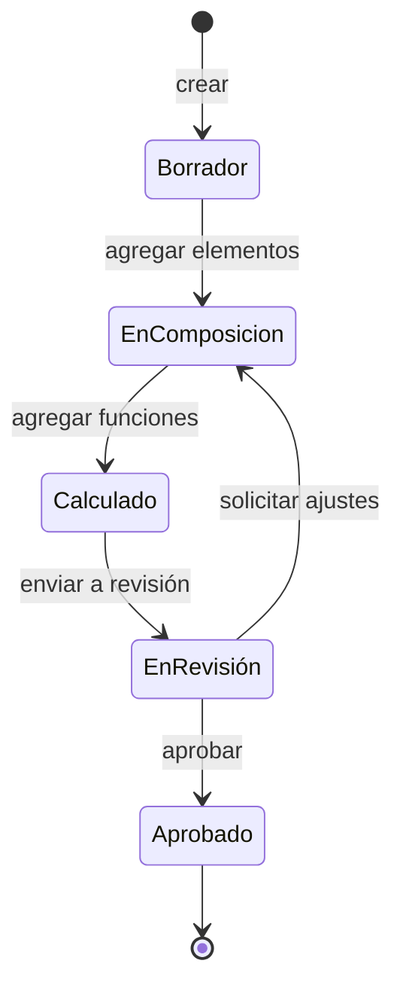

# DOC-03 — Especificación Funcional y Módulos del Sistema

**Proyecto:** Plataforma Rymel
**Cliente:** Rymel
**Versión:** 1.0.0
**Autor:** Alex Pinaida
**Fecha:** 2026-05-06

---

## 1. Introducción

Este documento detalla la **especificación funcional** de la Plataforma Rymel a nivel de módulo. Para cada módulo se describen su responsabilidad, sus entidades de dominio, sus operaciones expuestas, sus reglas de negocio y sus dependencias.

El sistema se organiza en **doce módulos de negocio** en el backend, dos **aplicaciones frontend** y un **microservicio criptográfico**.

---

## 2. Mapa funcional general



---

## 3. Módulos del backend

### 3.1 Módulo 1 — Autenticación y Autorización (`auth`)

| Atributo | Valor |
|----------|-------|
| **Responsabilidad** | Validar credenciales, emitir JWT y aplicar control de acceso por rol (RBAC) globalmente. |
| **Entidad principal** | `User` (compartida con Módulo 2) |
| **Dependencias** | `bcrypt`, `@nestjs/jwt`, `passport-jwt` |
| **Acceso** | Endpoint público (`/auth/login`); resto del sistema requiere JWT. |

**Operaciones expuestas**

| Método | Endpoint | Descripción |
|--------|----------|-------------|
| POST | `/auth/login` | Autentica al usuario, retorna `{ token }`. Recibe `{ email, password, app }`. El parámetro `app` distingue contexto (`ADMIN` para `project-admin`, `USER` para `project-front`). |

**Reglas de negocio**

- RN-AUTH-01: La validación es estricta (`isActive = true` obligatorio).
- RN-AUTH-02: El JWT contiene `sub`, `email`, `roles[]`, `exp`.
- RN-AUTH-03: Los `RolesGuard` y `JwtAuthGuard` aplican como guardas globales.

---

### 3.2 Módulo 2 — Usuarios (`users`)

| Atributo | Valor |
|----------|-------|
| **Responsabilidad** | Gestión del ciclo de vida de los usuarios y sus roles. |
| **Entidad principal** | `User` |
| **Roles autorizados** | `ADMIN` |

**Operaciones expuestas**

| Método | Endpoint | Descripción |
|--------|----------|-------------|
| POST | `/users` | Crea un usuario con uno o más roles. |
| GET | `/users` | Lista paginada con filtros. |
| GET | `/users/:id` | Detalle de usuario. |
| PUT | `/users/:id` | Actualiza nombre, correo y roles. |
| PATCH | `/users/:id/toggle-status` | Activa/desactiva sin borrar. |
| DELETE | `/users/:id` | Eliminación lógica (si aplica). |

**Atributos de la entidad**

| Campo | Tipo | Notas |
|-------|------|-------|
| `id` | UUID | Clave primaria |
| `email` | string | Único |
| `passwordHash` | string | bcrypt |
| `name` | string | — |
| `roles` | enum[] | `ADMIN`, `NORM`, `DESIGN` |
| `isActive` | boolean | — |
| `createdBy`, `createdAt`, `updatedBy`, `updatedAt` | auditoría | Migración `1764901127685` |

**Reglas**

- RN-USR-01: No se permiten correos duplicados.
- RN-USR-02: Las contraseñas se hashean antes de persistir.
- RN-USR-03: Los campos de auditoría son obligatorios y los completa el sistema.

---

### 3.3 Módulo 3 — Países (`country`)

| Atributo | Valor |
|----------|-------|
| **Responsabilidad** | Catálogo de países que actúan como ámbito territorial de las normas. |
| **Entidad principal** | `Country` |
| **Roles autorizados** | `ADMIN`, `NORM` |

**Operaciones**

| Método | Endpoint | Descripción |
|--------|----------|-------------|
| POST | `/country` | Crear país. |
| GET | `/country` | Listar países. |
| PUT | `/country/:id` | Actualizar. |
| DELETE | `/country/:id` | Eliminar (con validación de dependencias). |

**Atributos**

| Campo | Tipo |
|-------|------|
| `id` | UUID |
| `code` | string ISO único |
| `name` | string |

**Reglas**

- RN-CO-01: No se permite eliminar un país con normas asociadas (RN-09 del SRS).

---

### 3.4 Módulo 4 — Normas (`norm`)

| Atributo | Valor |
|----------|-------|
| **Responsabilidad** | Gestionar normas eléctricas: especificaciones, archivos adjuntos y elementos asociados. |
| **Entidades** | `Norm`, `NormSpecification` |
| **Roles autorizados** | `ADMIN`, `NORM` |

**Operaciones**

| Método | Endpoint | Descripción |
|--------|----------|-------------|
| POST | `/norm` | Crear norma. |
| GET | `/norm` | Listar (paginado). |
| GET | `/norm/:id` | Detalle. |
| PUT | `/norm/:id` | Actualizar. |
| DELETE | `/norm/:id` | Eliminar. |
| POST | `/norm/:id/file` | Adjuntar archivo (multer). |

**Atributos clave**

| Entidad | Campo | Notas |
|---------|-------|-------|
| `Norm` | `countryId` | FK obligatoria |
| `Norm` | `code`, `name` | identificación |
| `Norm` | `filePath` | adjunto opcional |
| `NormSpecification` | `description` | detalle textual |

**Reglas**

- RN-NM-01: Una norma debe estar siempre asociada a un país (RN-02).
- RN-NM-02: Los elementos de una norma deben pertenecer al mismo país (RN-01).

---

### 3.5 Módulo 5 — Campos / Tipos / Subtipos (`field`, `type`, `subtype`)

| Atributo | Valor |
|----------|-------|
| **Responsabilidad** | Modelar la jerarquía de clasificación de elementos eléctricos: Field → Type → SubType. |
| **Entidades** | `Field`, `Type`, `SubType` |
| **Roles autorizados** | `ADMIN`, `NORM` |

**Operaciones (por entidad)**

| Método | Endpoint | Descripción |
|--------|----------|-------------|
| POST/GET/PUT/DELETE | `/field` | CRUD de Field |
| POST/GET/PUT/DELETE | `/type` | CRUD de Type (FK a Field) |
| POST/GET/PUT/DELETE | `/subtype` | CRUD de SubType (FK a Type, con `code` y `specification`) |

**Reglas**

- RN-FT-01: La jerarquía Field → Type → SubType es estricta y obligatoria (RN-08).
- RN-FT-02: Un SubType posee `code` y `specification` (migración `1735256664271`).

---

### 3.6 Módulo 6 — Elementos (`element`)

| Atributo | Valor |
|----------|-------|
| **Responsabilidad** | Catálogo central de componentes eléctricos parametrizados con referencia SAP. |
| **Entidad principal** | `Element` |
| **Roles autorizados** | `ADMIN`, `NORM` (gestión); `DESIGN` (lectura). |

**Operaciones**

| Método | Endpoint |
|--------|----------|
| POST/GET/PUT/DELETE | `/element` |

**Atributos**

| Campo | Tipo | Notas |
|-------|------|-------|
| `id` | UUID | — |
| `normId` | UUID FK | obligatoria |
| `typeId` | UUID FK | obligatoria |
| `subTypeId` | UUID FK | obligatoria |
| `sapReference` | string | referencia ERP |
| `code` | string | código interno |
| `description` | text | descripción larga |
| `unit` | string | unidad de medida |

**Reglas**

- RN-EL-01: El elemento debe pertenecer a una Norma, un Type y un SubType existentes y consistentes.
- RN-EL-02: La referencia SAP debe ser única dentro del catálogo activo.

---

### 3.7 Módulo 7 — Accesorios (`accesory`)

| Atributo | Valor |
|----------|-------|
| **Responsabilidad** | Consultar inventario externo (Kompass Labs) y exponer accesorios al frontend. |
| **Entidad principal** | No persiste; actúa como fachada. |
| **Roles autorizados** | `ADMIN`, `DESIGN` |
| **Dependencias** | Cliente HTTP autenticado a `https://rymelapi.kompasslabs.com`. |

**Operaciones**

| Método | Endpoint | Descripción |
|--------|----------|-------------|
| GET | `/accesory?keyword=...&type=...` | Proxy hacia `POST /api/DocumentInbox/getItems` con autenticación API Key. |

**Reglas**

- RN-ACC-01: La API Key se obtiene exclusivamente de variable de entorno.
- RN-ACC-02: El frontend nunca llama directamente a Kompass Labs.

---

### 3.8 Módulo 8 — Semielaborados (`semi-finished`)

| Atributo | Valor |
|----------|-------|
| **Responsabilidad** | Gestionar componentes semielaborados utilizables en diseños. |
| **Entidad principal** | `SemiFinished` |
| **Roles autorizados** | `ADMIN`, `NORM`, `DESIGN` (lectura). |

**Atributos**

| Campo | Tipo |
|-------|------|
| `id` | UUID |
| `code` | string |
| `description` | string |

**Operaciones**

| Método | Endpoint |
|--------|----------|
| POST/GET/PUT/DELETE | `/semi-finished` |

---

### 3.9 Módulo 9 — Diseños (`design`)

| Atributo | Valor |
|----------|-------|
| **Responsabilidad** | Núcleo de la operación de ingeniería: crear, componer y mantener diseños eléctricos. |
| **Entidades** | `Design`, `DesignType`, `DesignSubType`, `DesignElement`, `DesignFunction`, `DesignSubTypeFunction`, `SubDesign`, `SpecialItem` |
| **Roles autorizados** | `ADMIN`, `DESIGN` |

**Operaciones principales**

| Método | Endpoint | Descripción |
|--------|----------|-------------|
| POST | `/design` | Crear cabecera de diseño. |
| GET | `/design` | Listar diseños (con paginación). |
| GET | `/design/:id` | Detalle completo (incluye elementos, funciones, plantillas, costos). |
| PUT | `/design/:id` | Actualizar diseño. |
| DELETE | `/design/:id` | Eliminar diseño. |
| POST | `/design/:id/elements` | Asociar elementos. |
| POST | `/design/:id/functions` | Asociar función (solicita cifrado al Function Engine). |
| POST | `/design/:id/subdesigns` | Crear subdiseño. |

**Estados del diseño (sugeridos)**



> Estos estados son una propuesta funcional para la próxima fase; ver DOC-04 §6.

**Reglas**

- RN-DS-01: Un diseño debe tener tipo y subtipo antes de aceptar funciones (RN-05).
- RN-DS-02: Las funciones se almacenan **siempre cifradas** (RN-04).
- RN-DS-03: Modificar elementos o funciones invalida los costos previos (deben recalcularse — RN-06).

---

### 3.10 Módulo 10 — Plantillas y Hojas (`design.template`, `design.sheet`)

| Atributo | Valor |
|----------|-------|
| **Responsabilidad** | Gestionar plantillas documentales asociadas a diseños y sus hojas componentes. |
| **Entidades** | `Template`, `Sheet` |
| **Roles autorizados** | `ADMIN`, `DESIGN` |

**Operaciones**

| Método | Endpoint | Descripción |
|--------|----------|-------------|
| POST | `/design/:id/templates` | Crear plantilla (tipo `DESIGN` u otros). |
| GET | `/design/:id/templates` | Listar plantillas. |
| POST | `/templates/:id/sheets` | Agregar hojas. |

**Reglas**

- RN-TPL-01: Las hojas pertenecen a una plantilla; eliminar plantilla elimina sus hojas en cascada.

---

### 3.11 Módulo 11 — Costos (`costs`)

| Atributo | Valor |
|----------|-------|
| **Responsabilidad** | Registrar y desglosar los costos asociados a un diseño. |
| **Entidades** | `Cost`, `SubCost` |
| **Roles autorizados** | `ADMIN`, `DESIGN` |

**Operaciones**

| Método | Endpoint |
|--------|----------|
| POST/GET/PUT/DELETE | `/cost` |
| POST | `/cost/:id/sub-costs` |

**Reglas**

- RN-CO-01: Cada SubCost se asocia a un Cost padre.
- RN-CO-02: La suma de SubCost debe coincidir con el total del Cost (validación de consistencia).
- RN-CO-03: Los costos se invalidan al modificar elementos o funciones del diseño asociado.

---

### 3.12 Módulo 12 — Function Engine (microservicio independiente)

| Atributo | Valor |
|----------|-------|
| **Responsabilidad** | Cifrar fórmulas de diseño y evaluarlas con parámetros y constantes. |
| **Componente** | `secure-function-engine-api` |
| **Tecnología** | NestJS, `crypto-js`, `node-forge`, `mathjs` |
| **Acceso** | Solo desde `project-back`, en red privada. |

**Operaciones**

| Método | Endpoint | Entrada | Salida |
|--------|----------|---------|--------|
| POST | `/function-engine/encrypt` | `{ plainTextFunction: string }` | `{ encrypted: string }` |
| POST | `/function-engine/evaluate-function` | `{ encryptedFunction, parameters, constants }` | `{ result }` |

**Reglas**

- RN-FN-01: Las fórmulas no se persisten en este microservicio.
- RN-FN-02: La clave de cifrado se gestiona por variable de entorno `ENCRYPTION_KEY`.
- RN-FN-03: La evaluación usa `mathjs` con un alcance restringido (parámetros + constantes), evitando ejecución arbitraria.

---

## 4. Aplicaciones frontend

### 4.1 `project-front` — Aplicación de operación

#### 4.1.1 Responsabilidades funcionales

- Autenticar usuarios con roles `ADMIN`, `NORM`, `DESIGN`.
- Permitir gestión de normas y elementos asociados.
- Permitir creación, edición y consulta de diseños eléctricos.
- Componer visualmente los diseños con elementos y funciones.
- Visualizar costos y resultados calculados.

#### 4.1.2 Estructura de pantallas

| Pantalla | Ruta | Roles | Propósito |
|----------|------|-------|-----------|
| Login | `/login` | público | Autenticación |
| Listado de normas | `/` | ADMIN, NORM | Catálogo |
| Crear norma | `/norms/new` | ADMIN, NORM | Alta |
| Editar norma | `/norms/edit/:id` | ADMIN, NORM | Edición |
| Workspace de diseño | `/design` | ADMIN, DESIGN | Composición |
| Composición de elementos | `/elements/design` | ADMIN, DESIGN | Selección de elementos |
| Listado de diseños | `/design/list` | ADMIN, DESIGN | Catálogo |
| Detalle de diseño | `/design/:id/details` | ADMIN, DESIGN | Vista de solo lectura |
| Acceso denegado | `/forbidden` | cualquier | Mensaje de control de acceso |

#### 4.1.3 Estado y caché

- **Redux Toolkit** mantiene estado global (sesión, selección actual de norma/diseño).
- **RTK Query** cachea respuestas REST por endpoint (`authApi`, `normApi`, `elementApi`, `typeApi`, `countryApi`, `designApi`).
- **Contextos React** (`AuthContext`, `NormProvider`) encapsulan la sesión y el contexto normativo activo.

---

### 4.2 `project-admin` — Consola administrativa

#### 4.2.1 Responsabilidades funcionales

- Acceso restringido al rol `ADMIN`.
- Dashboard general del sistema.
- Gestión completa de usuarios.

#### 4.2.2 Estructura de pantallas

| Pantalla | Ruta | Roles | Propósito |
|----------|------|-------|-----------|
| Login | `/login` | público | Autenticación |
| Dashboard | `/dashboard` | ADMIN | Métricas generales |
| Usuarios | `/users` | ADMIN | CRUD + activación |

#### 4.2.3 Estado

- **Zustand** persiste sesión en `localStorage` (claves de token y datos de usuario).
- **TanStack React Query** gestiona el estado servidor (`useUsers`, `useAuth`).
- **Axios interceptors** inyectan token y manejan respuesta 401 → redirección al login.

---

## 5. Matriz funcional consolidada (módulo × rol)

| Módulo | ADMIN | NORM | DESIGN |
|--------|:-----:|:----:|:------:|
| Auth | ✔ | ✔ | ✔ |
| Usuarios | ✔ | — | — |
| Países | ✔ | ✔ | — |
| Normas | ✔ | ✔ | — |
| Field/Type/SubType | ✔ | ✔ | lectura |
| Elementos | ✔ | ✔ | lectura |
| Accesorios | ✔ | — | ✔ |
| Semielaborados | ✔ | ✔ | lectura |
| Diseños | ✔ | — | ✔ |
| Plantillas | ✔ | — | ✔ |
| Costos | ✔ | — | ✔ |
| Function Engine | (interno) | (interno) | (interno) |

---

## 6. Interfaces y contratos transversales

### 6.1 Estructura de respuesta REST estándar

```json
{
  "data": { /* payload */ },
  "meta": {
    "page": 1,
    "limit": 20,
    "total": 134
  }
}
```

### 6.2 Estructura de error estándar (NestJS)

```json
{
  "statusCode": 400,
  "message": ["email must be an email"],
  "error": "Bad Request"
}
```

### 6.3 JWT esperado

```json
{
  "sub": "uuid-del-usuario",
  "email": "user@cliente.com",
  "roles": ["ADMIN"],
  "exp": 1746345600
}
```

---

## 7. Trazabilidad SRS → Módulo

| Requerimiento (DOC-01) | Módulo |
|------------------------|--------|
| RF-001 .. RF-006 | M1 |
| RF-010 .. RF-015 | M2 |
| RF-020 .. RF-022 | M3 |
| RF-030 .. RF-035 | M4 |
| RF-040 .. RF-044 | M5, M6, M7, M8 |
| RF-050 .. RF-057 | M9, M10 |
| RF-060 .. RF-063 | M11 |
| RF-070 .. RF-074 | M12 |
| RF-080 .. RF-082 | M7 |
| RF-090 .. RF-093 | `project-admin` |
| RF-100 .. RF-104 | `project-front` |

---

## 8. Control de versiones del documento

| Versión | Fecha | Autor | Descripción del cambio |
|---------|-------|-------|------------------------|
| 1.0.0 | 2026-05-06 | Alex Pinaida | Línea base inicial: especificación funcional de los 12 módulos backend, las 2 aplicaciones frontend y el microservicio Function Engine, con matriz de roles y trazabilidad SRS. |
