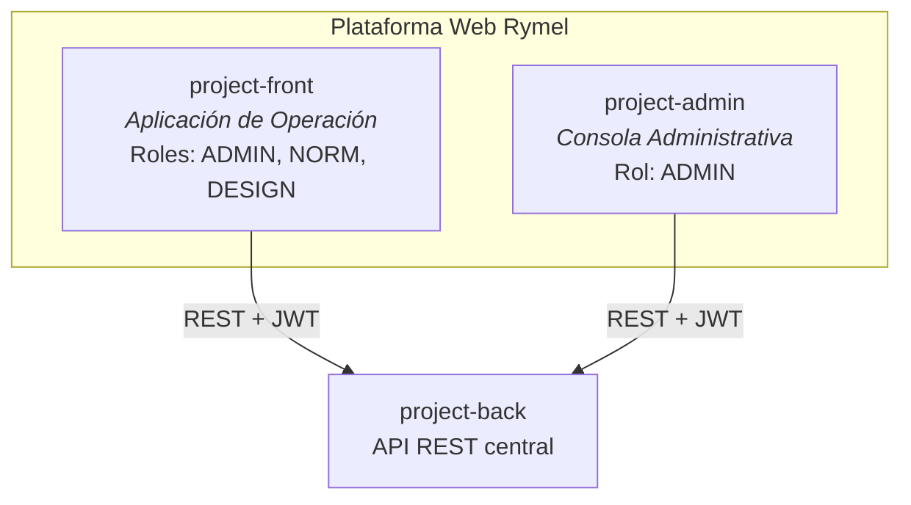
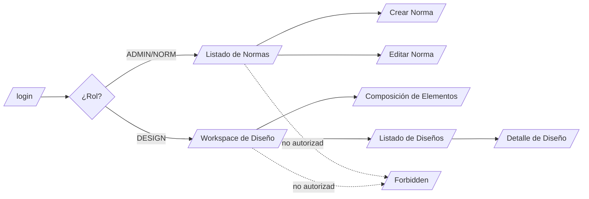
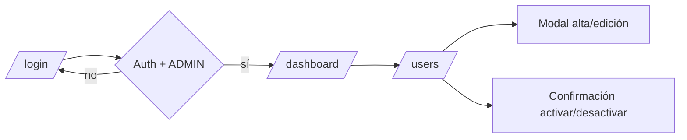
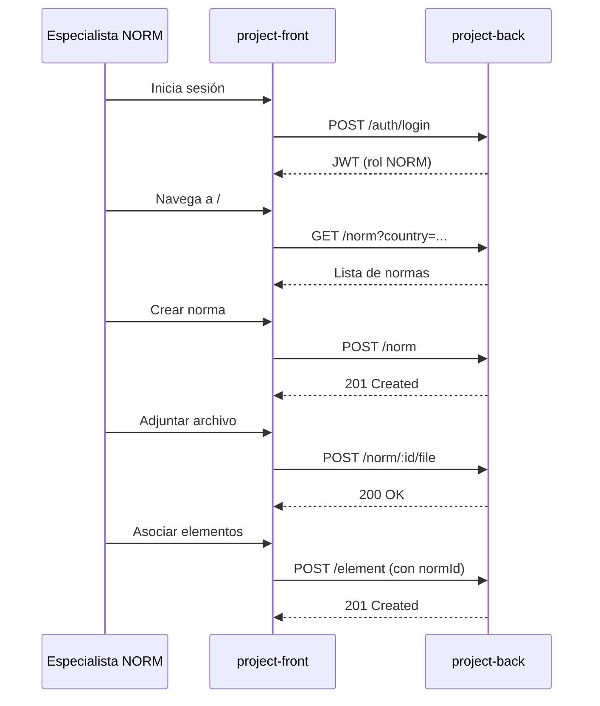
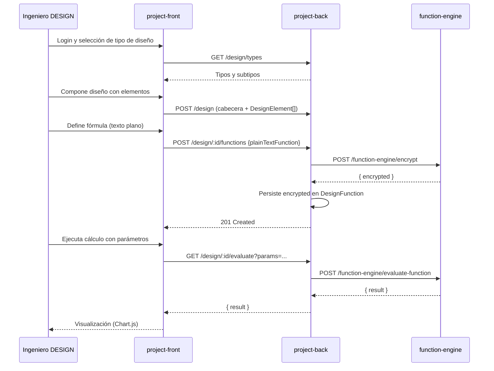
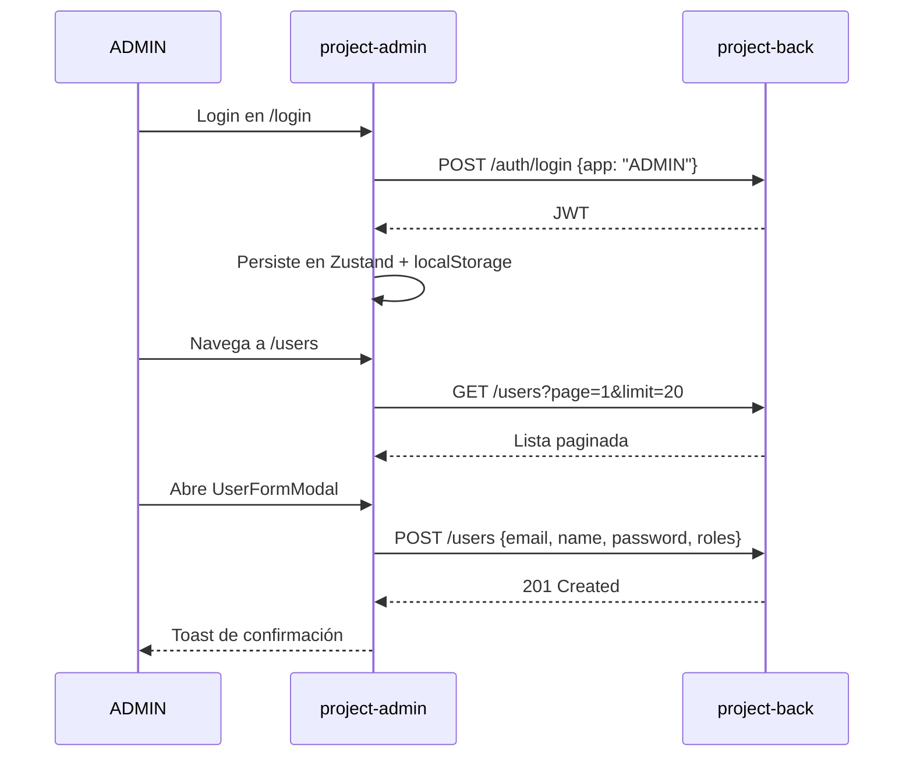
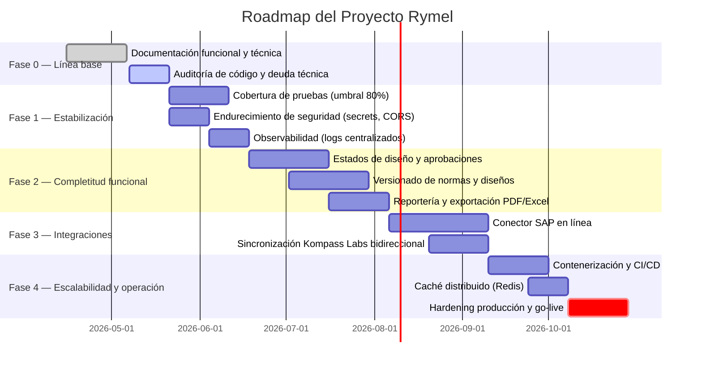
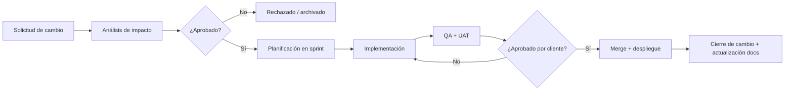

# DOC-04 — Estructura de la Aplicación Web y Plan de Fases

**Proyecto:** Plataforma Rymel
**Cliente:** Rymel
**Versión:** 1.0.0
**Autor:** Alex Pinaida
**Fecha:** 2026-05-06

---

## 1. Introducción

Este documento describe:

1. La **estructura general de la aplicación web** (mapa de navegación, jerarquía de pantallas, flujos de usuario, capa de presentación).
2. La **organización de procesos** y el **roadmap por fases** para el desarrollo subsiguiente.

Su objetivo es servir como guía formal para el equipo de desarrollo y como compromiso de entregables ante el cliente.

---

## 2. Estructura general de la solución web

La plataforma Rymel se distribuye en **dos aplicaciones web independientes** que comparten el mismo backend:

| Aspecto | `project-front` | `project-admin` |
|---------|-----------------|------------------|
| Propósito | Operación de ingeniería (normas, diseños) | Administración del sistema (usuarios) |
| Audiencia | Especialistas de normas e ingenieros de diseño | Administradores |
| Stack | React 19 + Vite 5 + Redux Toolkit + RTK Query + React Router | React 19 + Vite 7 + Zustand + React Query + Wouter + Axios |
| Estilos | Tailwind CSS v3 | Tailwind CSS v4 |
| Notificaciones | Inline / modales | Toasts (sonner) |
| URL dev | `http://localhost:5173` | `http://localhost:5174` |

---

## 3. Mapa de navegación — `project-front`

### 3.1 Diagrama general de rutas

### 3.2 Inventario de pantallas

| # | Pantalla | Ruta | Roles | Componentes clave |
|---|----------|------|-------|-------------------|
| 1 | Login | `/login` | público | Form, AuthContext |
| 2 | Listado de normas | `/` | ADMIN, NORM | Tabla paginada, filtros, NormProvider |
| 3 | Crear norma | `/norms/new` | ADMIN, NORM | Formulario, selector de país, adjuntos |
| 4 | Editar norma | `/norms/edit/:id` | ADMIN, NORM | Formulario, asociación de elementos |
| 5 | Workspace de diseño | `/design` | ADMIN, DESIGN | Lienzo de composición, selector de tipo/subtipo |
| 6 | Composición de elementos | `/elements/design` | ADMIN, DESIGN | Drag-and-drop / selección, panel de elementos |
| 7 | Listado de diseños | `/design/list` | ADMIN, DESIGN | Tabla paginada, búsqueda |
| 8 | Detalle de diseño | `/design/:id/details` | ADMIN, DESIGN | Vista lectura, Chart.js para visualizaciones |
| 9 | Forbidden | `/forbidden` | cualquier | Mensaje de control de acceso |

### 3.3 Layout y componentes core

- **Navbar superior** con identificación de usuario, rol y botón de cierre de sesión.
- **Componente `ProtectedRoute`** que valida JWT vigente y rol autorizado.
- **Skeletons** durante peticiones asíncronas.
- **Sistema de alertas** centralizado (`useAlertError`).

---

## 4. Mapa de navegación — `project-admin`

### 4.1 Diagrama de rutas

### 4.2 Inventario de pantallas

| # | Pantalla | Ruta | Componentes clave |
|---|----------|------|-------------------|
| 1 | Login | `/login` | LoginForm, authStore |
| 2 | Dashboard | `/dashboard` | Layout, métricas, accesos rápidos |
| 3 | Usuarios | `/users` | Tabla paginada, UserFormModal, toggle de estado |

### 4.3 Layout

- **Navbar lateral o superior** con marca, nombre del administrador y logout.
- **Layout maestro** que envuelve todas las páginas autenticadas.
- **Componente `ProtectedRoute`** verifica autenticación y rol ADMIN.

---

## 5. Flujos de usuario clave

### 5.1 Flujo: gestión de una norma (rol NORM)

### 5.2 Flujo: creación de diseño con función calculada (rol DESIGN)

### 5.3 Flujo: alta de usuario (rol ADMIN)

---

## 6. Roadmap de procesos por fases

A continuación se presenta la **organización de procesos** propuesta para las próximas fases del desarrollo, partiendo del estado actual del avance.

### 6.1 Línea de tiempo macro

### 6.2 Fase 0 — Línea base documental (en cierre)

| Proceso | Descripción | Entregable | Estado |
|---------|-------------|------------|--------|
| Inventario funcional y técnico | Análisis de los 4 proyectos y documentación formal. | Paquete documental v1.0 (DOC-01 a DOC-04). | **Completado** |
| Auditoría de código y deuda técnica | Identificación de gaps, deuda y riesgos. | Reporte de hallazgos. | En curso |

### 6.3 Fase 1 — Estabilización (4–6 semanas)

| Proceso | Descripción | Entregable |
|---------|-------------|------------|
| Pruebas automatizadas | Llevar la cobertura del backend al umbral configurado (80%) y agregar pruebas E2E mínimas en frontends. | Reporte de cobertura, suites de Jest y supertest, plan de E2E. |
| Endurecimiento de seguridad | Migrar secretos a un gestor (Azure Key Vault u otro), rotar JWT y `ENCRYPTION_KEY`, restringir CORS por entorno. | Documento de configuración de seguridad. |
| Observabilidad | Logs estructurados, métricas básicas y alertas (latencia, errores 5xx). | Stack de observabilidad operativo. |
| Validación de DTOs | Auditar todos los DTOs y reforzar `class-validator`. | Diff de validaciones reforzadas. |

### 6.4 Fase 2 — Completitud funcional (6–8 semanas)

| Proceso | Descripción | Entregable |
|---------|-------------|------------|
| Estados de diseño y aprobaciones | Implementar flujo Borrador → En revisión → Aprobado (DOC-03 §3.9). | Máquina de estados, endpoints de transición, UI de aprobación. |
| Versionado de normas y diseños | Mantener historial inmutable y revisiones publicables. | Módulo de versionado, migraciones y UI. |
| Reportería | Exportación de diseños y costos a PDF/Excel; tableros comparativos. | Servicio de reportes, plantillas. |
| UX de composición | Mejorar el lienzo de composición de elementos (drag-and-drop, validaciones inline). | Componentes refactorizados. |

### 6.5 Fase 3 — Integraciones (4–6 semanas)

| Proceso | Descripción | Entregable |
|---------|-------------|------------|
| Integración SAP | Conector en línea para sincronizar referencias y precios. | Microservicio o módulo `sap-connector`. |
| Sincronización Kompass Labs | Pasar de consulta puntual a sincronización periódica/bidireccional. | Job programado, conciliación de catálogo. |
| Webhooks y notificaciones | Notificar a sistemas externos eventos de aprobación/cierre. | Mecanismo de webhooks firmados. |

### 6.6 Fase 4 — Escalabilidad y operación (6–8 semanas)

| Proceso | Descripción | Entregable |
|---------|-------------|------------|
| Contenerización | Dockerfile y `docker-compose` para los 4 componentes. | Imágenes versionadas. |
| CI/CD | Pipelines de build, pruebas y despliegue por entorno. | Workflows (GitHub Actions / GitLab CI). |
| Caché distribuido | Redis para catálogos de alta lectura. | Capa de caché con invalidación controlada. |
| Hardening productivo | Pruebas de carga, plan de respaldo y recuperación. | Plan DRP, runbooks. |
| Go-live y soporte | Despliegue final y plan de soporte hipercare. | Acta de go-live. |

---

## 7. Procesos de gobernanza

### 7.1 Gestión de cambios

### 7.2 Gestión de releases

| Tipo | Periodicidad | Contenido | Aprobación |
|------|--------------|-----------|------------|
| **Mayor** | Cierre de fase | Funcionalidad nueva | Cliente |
| **Menor** | Bisemanal | Mejoras y ajustes | PM + Tech Lead |
| **Hotfix** | Bajo demanda | Correcciones críticas | Tech Lead |

### 7.3 Gestión de calidad

- **Definition of Ready** (DoR): historia con criterios de aceptación, mockups y dependencias resueltas.
- **Definition of Done** (DoD): código mergeado, pruebas pasando, cobertura no degradada, documentación de API actualizada, revisado por par.
- **UAT** por proceso de negocio antes de cada cierre de fase.

### 7.4 Gestión documental

- Toda nueva funcionalidad debe actualizar al menos uno de los documentos del paquete (`DOC-01` a `DOC-04`).
- Las versiones del paquete se incrementan en cada cierre de fase.
- El cliente firma la versión al cierre de cada fase.

---

## 8. Riesgos identificados y mitigaciones

| Riesgo | Probabilidad | Impacto | Mitigación |
|--------|:------------:|:-------:|------------|
| Filtración de la `ENCRYPTION_KEY` del Function Engine | Baja | Alto | Gestión por secret manager, rotación y aislamiento de red. |
| Inconsistencia entre referencias SAP locales y ERP del cliente | Media | Medio | Conector SAP en línea (Fase 3) y job de conciliación. |
| Crecimiento del catálogo (>10⁵ elementos) afectando rendimiento | Media | Medio | Indexación, paginación estricta, caché Redis (Fase 4). |
| Cambios normativos por país que rompan diseños existentes | Media | Alto | Versionado de normas (Fase 2) y advertencia visible en diseños afectados. |
| Pérdida de fórmulas si se pierde la clave de cifrado | Baja | Crítico | Custodia segura de claves y respaldos cifrados independientes. |

---

## 9. Indicadores de avance (KPIs propuestos)

| KPI | Meta | Frecuencia |
|-----|------|------------|
| Cobertura de pruebas backend | ≥ 80 % | Quincenal |
| Tiempo medio de respuesta API (P95) | ≤ 500 ms | Semanal |
| Disponibilidad mensual | ≥ 99,5 % | Mensual |
| Tickets de soporte críticos resueltos < 24h | ≥ 95 % | Mensual |
| Documentación actualizada por release | 100 % | Por release |

---

## 10. Cierre

Este paquete documental establece la **línea base v1.0** del avance funcional y técnico de la Plataforma Rymel y define la organización de procesos para las fases subsiguientes. Cualquier modificación posterior se gestionará a través del proceso de control de cambios descrito en §7.1, con actualización formal de los documentos correspondientes.

| Aprobación | Nombre | Cargo | Fecha | Firma |
|------------|--------|-------|-------|-------|
| Por el Cliente | | | | |
| Por el Equipo de Ingeniería | | | | |

---

## 11. Control de versiones del documento

| Versión | Fecha | Autor | Descripción del cambio |
|---------|-------|-------|------------------------|
| 1.0.0 | 2026-05-06 | Alex Pinaida | Línea base inicial: estructura web de las dos aplicaciones, mapas de navegación, flujos de usuario, roadmap por fases (0–4), gobernanza, riesgos y KPIs. |
